# Multi-Region Hub-Spoke Example

This example deploys a **multi-region hub-spoke network topology** - the recommended architecture for production workloads requiring high availability and disaster recovery.

## Architecture

```mermaid
flowchart TB
    subgraph mesh["Mesh VNet Peering"]
        direction LR

        subgraph hubSouth["Hub UK South (10.0.0.0/16)"]
            direction TB
            fw1["✓ Firewall"]
            dns1["✓ DNS Zones"]
            resolver1["✓ DNS Resolver"]
            autoreg1["✓ Auto-Reg Zone"]
            pe1["✓ PE Subnet"]
            bas1["○ Bastion"]
            vpn1["○ VPN Gateway"]
            er1["○ ExpressRoute"]
        end

        subgraph hubWest["Hub UK West (10.1.0.0/16)"]
            direction TB
            fw2["✓ Firewall"]
            dns2["✓ DNS Zones"]
            resolver2["✓ DNS Resolver"]
            autoreg2["✓ Auto-Reg Zone"]
            pe2["✓ PE Subnet"]
            bas2["○ Bastion"]
            vpn2["○ VPN Gateway"]
            er2["○ ExpressRoute"]
        end

        hubSouth <--> hubWest
    end

    ampls["✓ Azure Monitor Private Link"]
    ddos["○ DDoS Protection Plan"]
    ampls --> mesh
    ddos -.-> mesh

    style mesh fill:#f5f5f5,stroke:#d0d0d0
    style hubSouth fill:#0078D4,stroke:#005A9E,color:#fff
    style hubWest fill:#0078D4,stroke:#005A9E,color:#fff
    style fw1 fill:#107C10,stroke:#0B5C0B,color:#fff
    style fw2 fill:#107C10,stroke:#0B5C0B,color:#fff
    style dns1 fill:#107C10,stroke:#0B5C0B,color:#fff
    style dns2 fill:#107C10,stroke:#0B5C0B,color:#fff
    style resolver1 fill:#107C10,stroke:#0B5C0B,color:#fff
    style resolver2 fill:#107C10,stroke:#0B5C0B,color:#fff
    style autoreg1 fill:#107C10,stroke:#0B5C0B,color:#fff
    style autoreg2 fill:#107C10,stroke:#0B5C0B,color:#fff
    style pe1 fill:#107C10,stroke:#0B5C0B,color:#fff
    style pe2 fill:#107C10,stroke:#0B5C0B,color:#fff
    style bas1 fill:#605E5C,stroke:#3B3A39,color:#fff
    style bas2 fill:#605E5C,stroke:#3B3A39,color:#fff
    style vpn1 fill:#605E5C,stroke:#3B3A39,color:#fff
    style vpn2 fill:#605E5C,stroke:#3B3A39,color:#fff
    style er1 fill:#605E5C,stroke:#3B3A39,color:#fff
    style er2 fill:#605E5C,stroke:#3B3A39,color:#fff
    style ampls fill:#107C10,stroke:#0B5C0B,color:#fff
    style ddos fill:#605E5C,stroke:#3B3A39,color:#fff
```



> [!NOTE]
> ✓ Enabled by default | ○ Optional (disabled)

## Quick Start

```bash
# 1. Copy example to root terraform directory
cp hub_and_spoke_vnet.tfvars ../../terraform.tfvars

# 2. Edit terraform.tfvars:
#    - Change hub regions (uksouth/ukwest) to your preferred locations
#    - Adjust features as needed

# 3. Set the subscription ID as an environment variable
export TF_VAR_connectivity_subscription_id=00000000-0000-0000-0000-000000000000

# 4. Initialize and deploy
eirctl infrastructure:plan
eirctl infrastructure:apply
```

## Configuration

### Required Variables

| Variable | Description | Example |
|----------|-------------|---------|
| `company` | Company identifier (first 3 chars used in names) | `"ensono"` |
| `hubs` | Map of hub configurations keyed by region | `{ uksouth = {}, ukwest = {} }` |

### Required Environment Variables

| Variable | Description | Example |
|----------|-------------|--------|
| `TF_VAR_connectivity_subscription_id` | Subscription for hub resources | `00000000-0000-0000-0000-000000000000` |

### Hub Features

Each hub can enable/disable these components:

| Feature | Default | Description |
|---------|---------|-------------|
| `firewall` | `true` | Azure Firewall for network security |
| `firewall_sku` | `"Standard"` | Firewall SKU: Basic/Standard/Premium |
| `firewall_management_ip` | `true` | Management IP for forced tunnelling |
| `private_dns_zones` | `true` | Private Link DNS zones |
| `private_dns_resolver` | `true` | DNS resolver for hybrid scenarios |
| `auto_registration_zone` | `true` | VM DNS auto-registration |
| `bastion` | `false` | Azure Bastion for VM access |
| `vpn_gateway` | `false` | VPN Gateway (S2S/P2S) |
| `expressroute_gateway` | `false` | ExpressRoute Gateway |
| `availability_zones` | `null` | Zones for 99.99% SLA |

### Module-Level Features

| Feature | Default | Description |
|---------|---------|-------------|
| `network_watcher.enabled` | `true` | Network Watcher (free) |
| `flow_logs.enabled` | `false` | VNet flow logs (storage costs apply) |
| `ddos_protection_plan.enabled` | `false` | DDoS Protection (~£2,200/month) |

### Example: Enable Bastion in Primary Hub

```hcl
hubs = {
  uksouth = {
    features = {
      bastion = true
    }
  }
  ukwest = {}
}
```

### Example: Custom IP Ranges

```hcl
hubs = {
  uksouth = {
    address_space = "172.16.0.0/16"
    subnets = {
      firewall_address_prefix = "172.16.0.0/26"
      bastion_address_prefix  = "172.16.0.64/26"
    }
  }
  ukwest = {
    address_space = "172.17.0.0/16"
  }
}
```

## What Gets Deployed

### Per Hub (each region)

- Resource Group for hub resources
- Virtual Network with required subnets
- Azure Firewall with policy (Standard SKU by default)
- Route tables for firewall routing
- VNet peering to other hubs (mesh)
- Network Watcher (free network diagnostics)
- Private Endpoints subnet (`snet-private-endpoints`)
- Optional: Bastion, VPN Gateway, ExpressRoute Gateway

### Shared Resources (primary region)

- Private DNS zones for Azure Private Link services
- Private DNS Resolver for hybrid DNS
- Azure Monitor Private Link Scope (AMPLS) with endpoints in each hub
- Optional: DDoS Protection Plan, Flow Logs with Traffic Analytics

## Estimated Costs

| Component | Monthly Cost (approx) |
|-----------|----------------------|
| Azure Firewall (Basic) | ~£180/hub |
| Azure Firewall (Standard) | ~£720/hub |
| Azure Firewall (Premium) | ~£800/hub |
| Azure Bastion (Basic) | ~£110/hub |
| VPN Gateway (VpnGw1) | ~£110/hub |
| ExpressRoute Gateway | ~£110/hub |
| AMPLS Private Endpoint | ~£7/hub |
| Flow Logs Storage | ~£15-50 (if enabled) |
| DDoS Protection Plan | ~£2,200 (global) |

*Costs vary by region and configuration. Use the [Azure Pricing Calculator](https://azure.microsoft.com/pricing/calculator/) for accurate estimates.*

## Files

| File | Description |
|------|-------------|
| [hub_and_spoke_vnet.tfvars](./hub_and_spoke_vnet.tfvars) | Example configuration - copy to `terraform.tfvars` |

## See Also

- [Single Region Example](../single_region/) - Simpler deployment (not recommended for production)
- [Module Variables](../../variables_hubs.tf) - Full variable documentation
