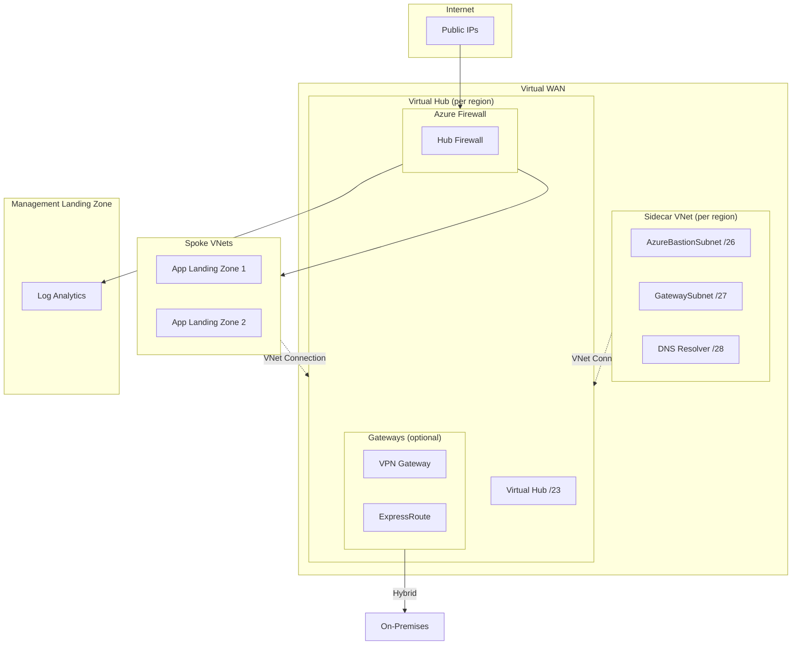

<!-- BEGIN_TF_DOCS -->
<!-- Code generated by terraform-docs. DO NOT EDIT. -->
# Stacks Azure Platform Landing Zone - Connectivity - Virtual WAN

This module deploys a Virtual WAN network topology using Azure Verified Modules (AVM). It supports single or multi-region deployments with automatic IP allocation and CAF-compliant naming.

## Architecture



## Features

| Feature | Default | Description |
|---------|---------|-------------|
| Virtual WAN | ✅ | Standard SKU Virtual WAN |
| Virtual Hubs | ✅ | One per region with /23 address prefix |
| Azure Firewall | ✅ | Standard SKU (configurable: Basic/Standard/Premium) |
| Firewall DNS Proxy | ✅ | Enables FQDN filtering and DNS query logging |
| Firewall Diagnostics | ✅ | All log categories sent to Log Analytics |
| Sidecar Virtual Network | ✅ | For Bastion, DNS Resolver, and additional services |
| Private DNS Zones | ✅ | For Azure Private Link services |
| Private DNS Resolver | ❌ | For hybrid DNS resolution |
| Azure Bastion | ❌ | Secure VM access (in sidecar VNet) |
| VPN Gateway | ❌ | Site-to-Site/Point-to-Site VPN |
| ExpressRoute Gateway | ❌ | ExpressRoute connectivity |
| DDoS Protection Plan | ❌ | Shared across all hubs |

## Configuration Examples

### Single Region Deployment

```hcl
company_name                 = "ensono"
connectivity_subscription_id = "00000000-0000-0000-0000-000000000000"

# Azure Monitor Private Link Scope (enabled by default)
# Use remote state to fetch workspace ID from management module
management_remote_state = {
  storage_account_name = "<storage-account-name>"
}

hubs = {
  uksouth = {}
}
```

### Multi-Region Deployment

```hcl
hubs = {
  uksouth = {}
  ukwest  = {}
}
```

IP addresses are calculated automatically (sorted alphabetically). Each hub receives a `/16` block, with the Virtual Hub using a `/23`:

| Region | Hub Address Space | Virtual Hub Prefix |
|--------|------------------|-------------------|
| uksouth | `10.0.0.0/16` | `10.0.0.0/23` |
| ukwest | `10.1.0.0/16` | `10.1.0.0/23` |

> [!NOTE]
> The module supports up to 256 regions using the `10.0.0.0/8` address space. Regions are sorted alphabetically for consistent IP allocation across deployments.

### Cost Optimization for Non-Production

Use Firewall Basic SKU for dev/test environments:

```hcl
hubs = {
  uksouth = {
    features = {
      firewall_sku = "Basic"  # ~£180/month vs Standard ~£720/month
    }
  }
}
```

| Firewall SKU | Monthly Cost | Use Case |
|--------------|-------------|----------|
| Basic | ~£180 | Dev/Test, low throughput |
| Standard | ~£720 | Production, threat intelligence |
| Premium | ~£800 | TLS inspection, IDPS signatures |

> [!WARNING]
> Firewall Basic SKU has reduced throughput (250 Mbps) and fewer features. Not recommended for production.

### DDoS Protection Plan

DDoS Protection Plan is **disabled by default** due to significant cost (~£2,200/month flat fee).

```hcl
ddos_protection_plan = {
  enabled = true
}
```

### Cost Estimation

Estimated monthly costs per hub (UK South, January 2025):

| Resource | Default | Monthly Cost (GBP) | Notes |
|----------|---------|-------------------|-------|
| Virtual Hub | ✅ | ~£210 | Base hub cost |
| Azure Firewall Standard | ✅ | ~£720 | Hub firewall |
| Azure Firewall Basic | ❌ | ~£180 | Dev/test alternative |
| VPN Gateway | ❌ | ~£140 | Scale unit 1 |
| ExpressRoute Gateway | ❌ | ~£140 | Scale unit 1 |
| Azure Bastion Standard | ❌ | ~£140 | 2 scale units |
| DDoS Protection Plan | ❌ | ~£2,200 | Shared across subscription |
| Log Analytics | - | Variable | ~£2/GB/month ingestion |
| **Minimum (Hub + Firewall)** | | **~£930** | |
| **Full Production** | | **~£1,210** | Hub + Firewall + VPN + Bastion |

> [!TIP]
> Virtual WAN costs more than hub-spoke due to the managed hub infrastructure, but provides simplified routing and better scalability for large deployments.

### Firewall DNS Proxy

DNS Proxy is **enabled by default** on the firewall policy, as recommended by [Microsoft's Well-Architected Framework](https://learn.microsoft.com/en-us/azure/well-architected/service-guides/azure-firewall#security).

DNS Proxy provides:

- **FQDN filtering** - Required for network rules that filter by FQDN (not just IP)
- **DNS query logging** - All DNS queries are logged to Log Analytics
- **Consistent resolution** - All spoke workloads resolve DNS through the firewall

To disable DNS Proxy:

```hcl
hubs = {
  uksouth = {
    features = {
      firewall_dns_proxy = false
    }
  }
}
```

To use custom DNS servers:

```hcl
hubs = {
  uksouth = {
    dns = {
      servers = ["10.0.0.4", "10.0.0.5"]  # Custom upstream DNS
    }
    features = {
      firewall_dns_proxy = true  # Default, shown for clarity
    }
  }
}
```

### Production Configuration

For production workloads:

```hcl
hubs = {
  uksouth = {
    features = {
      firewall_sku       = "Standard"
      bastion            = true
      vpn_gateway        = true
    }
  }
}

# Enable firewall diagnostics via management remote state
management_remote_state = {
  enabled              = true
  storage_account_name = "<storage-account-name>"
}
```

### Enable Optional Features

```hcl
hubs = {
  uksouth = {
    features = {
      bastion              = true
      vpn_gateway          = true
      expressroute_gateway = true
      private_dns_resolver = true
    }
  }
}
```

### Custom IP Addressing

```hcl
hubs = {
  uksouth = {
    address_space = "172.16.0.0/16"
    sidecar_subnets = {
      bastion_address_prefix              = "172.16.4.0/26"
      gateway_address_prefix              = "172.16.4.64/27"
      private_dns_resolver_address_prefix = "172.16.4.96/28"
    }
  }
}
```

### Custom Resource Names

```hcl
hubs = {
  uksouth = {
    name_overrides = {
      resource_group          = "rg-vwan-hub-prod"
      virtual_hub             = "vhub-prod-uks"
      sidecar_virtual_network = "vnet-sidecar-prod"
      firewall                = "fw-hub-prod"
    }
  }
}
```

### Disable a Hub Temporarily

```hcl
hubs = {
  uksouth = {}
  ukwest  = { enabled = false }
}
```

## Comparison: Virtual WAN vs Hub-Spoke

| Aspect | Virtual WAN | Hub-Spoke |
|--------|-------------|-----------|
| **Management** | Fully managed hub | Self-managed VNet |
| **Routing** | Automatic any-to-any | Manual route tables |
| **Cost** | Higher base cost | Lower base cost |
| **Scalability** | Better for large networks | Good for small-medium |
| **Hybrid** | Built-in VPN/ER integration | Manual gateway setup |
| **Complexity** | Lower operational | Higher operational |

**Choose Virtual WAN when:**

- You have 50+ spoke VNets
- You need global transit routing
- You want simplified VPN/ExpressRoute management
- Operational simplicity is more important than cost

**Choose Hub-Spoke when:**

- You have fewer spoke VNets
- Cost optimization is critical
- You need granular routing control
- You have existing hub-spoke infrastructure

## Module Integration

This module can integrate with the Management Landing Zone to enable:

- Firewall diagnostics to Log Analytics
- Centralized monitoring and alerting

```hcl
management_remote_state = {
  storage_account_name = "<storage-account-name>"
}
```

<!-- markdownlint-disable MD033 -->
## Requirements

The following requirements are needed by this module:

- <a name="requirement_terraform"></a> [terraform](#requirement\_terraform) (~> 1.12)

- <a name="requirement_azapi"></a> [azapi](#requirement\_azapi) (~> 2.0)

- <a name="requirement_azurerm"></a> [azurerm](#requirement\_azurerm) (~> 4.0)

- <a name="requirement_local"></a> [local](#requirement\_local) (~> 2.5)

- <a name="requirement_modtm"></a> [modtm](#requirement\_modtm) (~> 0.3)

- <a name="requirement_random"></a> [random](#requirement\_random) (~> 3.8)

## Resources

The following resources are used by this module:

- [azurerm_monitor_diagnostic_setting.bastion](https://registry.terraform.io/providers/hashicorp/azurerm/latest/docs/resources/monitor_diagnostic_setting) (resource)
- [azurerm_monitor_diagnostic_setting.expressroute_gateway](https://registry.terraform.io/providers/hashicorp/azurerm/latest/docs/resources/monitor_diagnostic_setting) (resource)
- [azurerm_monitor_diagnostic_setting.firewall](https://registry.terraform.io/providers/hashicorp/azurerm/latest/docs/resources/monitor_diagnostic_setting) (resource)
- [azurerm_monitor_diagnostic_setting.virtual_hub](https://registry.terraform.io/providers/hashicorp/azurerm/latest/docs/resources/monitor_diagnostic_setting) (resource)
- [azurerm_monitor_diagnostic_setting.vpn_gateway](https://registry.terraform.io/providers/hashicorp/azurerm/latest/docs/resources/monitor_diagnostic_setting) (resource)
- [azurerm_monitor_metric_alert.expressroute_bits_received](https://registry.terraform.io/providers/hashicorp/azurerm/latest/docs/resources/monitor_metric_alert) (resource)
- [azurerm_monitor_metric_alert.expressroute_cpu](https://registry.terraform.io/providers/hashicorp/azurerm/latest/docs/resources/monitor_metric_alert) (resource)
- [azurerm_monitor_metric_alert.firewall_health](https://registry.terraform.io/providers/hashicorp/azurerm/latest/docs/resources/monitor_metric_alert) (resource)
- [azurerm_monitor_metric_alert.firewall_latency](https://registry.terraform.io/providers/hashicorp/azurerm/latest/docs/resources/monitor_metric_alert) (resource)
- [azurerm_monitor_metric_alert.firewall_snat_exhaustion](https://registry.terraform.io/providers/hashicorp/azurerm/latest/docs/resources/monitor_metric_alert) (resource)
- [azurerm_monitor_metric_alert.firewall_throughput](https://registry.terraform.io/providers/hashicorp/azurerm/latest/docs/resources/monitor_metric_alert) (resource)
- [azurerm_monitor_metric_alert.virtual_hub_bgp_peer](https://registry.terraform.io/providers/hashicorp/azurerm/latest/docs/resources/monitor_metric_alert) (resource)
- [azurerm_monitor_metric_alert.virtual_hub_routing_capacity](https://registry.terraform.io/providers/hashicorp/azurerm/latest/docs/resources/monitor_metric_alert) (resource)
- [azurerm_monitor_metric_alert.vpn_bgp_peer_status](https://registry.terraform.io/providers/hashicorp/azurerm/latest/docs/resources/monitor_metric_alert) (resource)
- [azurerm_monitor_metric_alert.vpn_tunnel_bandwidth](https://registry.terraform.io/providers/hashicorp/azurerm/latest/docs/resources/monitor_metric_alert) (resource)
- [azurerm_monitor_private_link_scope.this](https://registry.terraform.io/providers/hashicorp/azurerm/latest/docs/resources/monitor_private_link_scope) (resource)
- [azurerm_monitor_private_link_scoped_service.log_analytics](https://registry.terraform.io/providers/hashicorp/azurerm/latest/docs/resources/monitor_private_link_scoped_service) (resource)
- [azurerm_network_watcher.this](https://registry.terraform.io/providers/hashicorp/azurerm/latest/docs/resources/network_watcher) (resource)
- [azurerm_network_watcher_flow_log.sidecar_vnet](https://registry.terraform.io/providers/hashicorp/azurerm/latest/docs/resources/network_watcher_flow_log) (resource)
- [azurerm_private_endpoint.ampls](https://registry.terraform.io/providers/hashicorp/azurerm/latest/docs/resources/private_endpoint) (resource)
- [azurerm_storage_management_policy.flow_logs](https://registry.terraform.io/providers/hashicorp/azurerm/latest/docs/resources/storage_management_policy) (resource)
- [azurerm_subnet_network_security_group_association.private_endpoints](https://registry.terraform.io/providers/hashicorp/azurerm/latest/docs/resources/subnet_network_security_group_association) (resource)
- [random_string.random_seed](https://registry.terraform.io/providers/hashicorp/random/latest/docs/resources/string) (resource)
- [terraform_data.validate_ampls_requirements](https://registry.terraform.io/providers/hashicorp/terraform/latest/docs/resources/data) (resource)
- [terraform_data.validate_flow_logs_requirements](https://registry.terraform.io/providers/hashicorp/terraform/latest/docs/resources/data) (resource)
- [azurerm_client_config.current](https://registry.terraform.io/providers/hashicorp/azurerm/latest/docs/data-sources/client_config) (data source)
- [terraform_remote_state.management](https://registry.terraform.io/providers/hashicorp/terraform/latest/docs/data-sources/remote_state) (data source)

<!-- markdownlint-disable MD013 -->
## Required Inputs

The following input variables are required:

### <a name="input_company_name"></a> [company\_name](#input\_company\_name)

Description: Company name used in resource naming. The first 3 characters are used as a prefix (e.g., 'ensono' becomes 'ens').

Type: `string`

### <a name="input_connectivity_subscription_id"></a> [connectivity\_subscription\_id](#input\_connectivity\_subscription\_id)

Description: Subscription ID for connectivity resources (virtual WAN, hubs, firewalls).

Type: `string`

### <a name="input_hubs"></a> [hubs](#input\_hubs)

Description: Virtual hub configurations keyed by Azure region name.

Type:

```hcl
map(object({
    enabled       = optional(bool, true)
    address_space = optional(string)

    features = optional(object({
      firewall                   = optional(bool, true)
      firewall_sku               = optional(string, "Standard")
      firewall_dns_proxy         = optional(bool, true)
      firewall_threat_intel_mode = optional(string, "Alert")
      bastion                    = optional(bool, false)
      vpn_gateway                = optional(bool, false)
      expressroute_gateway       = optional(bool, false)
      private_dns_zones          = optional(bool, true)
      private_dns_resolver       = optional(bool, false)
      sidecar_virtual_network    = optional(bool, true)
      availability_zones         = optional(list(number))
    }), {})

    hub = optional(object({
      sku                                    = optional(string)
      hub_routing_preference                 = optional(string, "ExpressRoute")
      virtual_router_auto_scale_min_capacity = optional(number, 2)
    }), {})

    sidecar_subnets = optional(object({
      bastion_address_prefix              = optional(string)
      gateway_address_prefix              = optional(string)
      private_dns_resolver_address_prefix = optional(string)
      private_endpoints_address_prefix    = optional(string)
    }), {})

    dns = optional(object({
      auto_registration_zone_name = optional(string)
      servers                     = optional(list(string))
    }), {})

    name_overrides = optional(object({
      resource_group          = optional(string)
      virtual_hub             = optional(string)
      sidecar_virtual_network = optional(string)
      firewall                = optional(string)
      firewall_policy         = optional(string)
      bastion                 = optional(string)
      vpn_gateway             = optional(string)
      expressroute_gateway    = optional(string)
      private_dns_resolver    = optional(string)
    }), {})

    tags = optional(map(string), {})
  }))
```

## Optional Inputs

The following input variables are optional (have default values):

### <a name="input_azure_monitor_private_link"></a> [azure\_monitor\_private\_link](#input\_azure\_monitor\_private\_link)

Description: Azure Monitor Private Link Scope configuration for private connectivity to Log Analytics.

Type:

```hcl
object({
    enabled                    = optional(bool, true)
    log_analytics_workspace_id = optional(string)
    ingestion_access_mode      = optional(string, "PrivateOnly")
    query_access_mode          = optional(string, "PrivateOnly")
    name                       = optional(string)
  })
```

Default: `{}`

### <a name="input_ddos_protection_plan"></a> [ddos\_protection\_plan](#input\_ddos\_protection\_plan)

Description: DDoS Protection Plan configuration. Disabled by default due to significant cost (~£2,200/month).

- `enabled` - (Optional) Enable DDoS Protection Plan. Default: `false`.

Type:

```hcl
object({
    enabled = optional(bool, false)
  })
```

Default: `{}`

### <a name="input_enable_avm_telemetry"></a> [enable\_avm\_telemetry](#input\_enable\_avm\_telemetry)

Description: Enable telemetry collection for Azure Verified Modules. See https://aka.ms/avm/telemetryinfo.

Type: `bool`

Default: `false`

### <a name="input_flow_logs"></a> [flow\_logs](#input\_flow\_logs)

Description:     Flow logs configuration for network traffic analysis on sidecar VNets. Disabled by default.

    Note: Virtual WAN hub traffic is managed by Microsoft and not visible via VNet flow logs.  
    Flow logs for Virtual WAN capture traffic in the sidecar virtual networks (Bastion, DNS Resolver, etc.).

    Per Microsoft documentation, the storage account MUST be in the same region as the VNet.  
    This module creates a storage account per hub region to ensure compliance.

    When enabled, creates:
    - Storage account per hub region
    - VNet flow logs for each sidecar virtual network

    Storage options:
    - create: Set to true (default) to create storage accounts
    - external\_storage\_account\_id: If create=false, provide an existing storage account ID
      (must be in same region as sidecar VNet)

    Optional:
    - Traffic Analytics (requires Log Analytics workspace via management\_remote\_state)

    Cost considerations:
    - Storage: ~£0.02/GB stored (~£15-50/month depending on traffic volume)
    - Traffic Analytics: Additional Log Analytics ingestion costs

    Note: Retention defaults to 90 days to meet security compliance requirements (CKV\_AZURE\_12).

Type:

```hcl
object({
    enabled                   = optional(bool, false)
    retention_days            = optional(number, 90)
    traffic_analytics_enabled = optional(bool, false)
    storage = optional(object({
      create                      = optional(bool, true)
      external_storage_account_id = optional(string, null)
      access_tier                 = optional(string, "Hot")
      account_kind                = optional(string, "StorageV2")
      account_replication_type    = optional(string, "GRS")
      account_tier                = optional(string, "Standard") # Premium not supported
      min_tls_version             = optional(string, "TLS1_2")
      public_network_access       = optional(bool, false)
      shared_access_key_enabled   = optional(bool, true)
      retention_days              = optional(number, 30) # Blob lifecycle
      network_rules = optional(object({
        ip_rules                   = optional(list(string), [])
        virtual_network_subnet_ids = optional(list(string), [])
      }), {})
    }), {})
  })
```

Default: `{}`

### <a name="input_hub_network_address_prefix"></a> [hub\_network\_address\_prefix](#input\_hub\_network\_address\_prefix)

Description: Base address space for hub networks. Each hub receives a /16.

Type: `string`

Default: `"10.0.0.0/8"`

### <a name="input_management_remote_state"></a> [management\_remote\_state](#input\_management\_remote\_state)

Description: Configuration for reading management landing zone state to get Log Analytics workspace ID.

- `enabled` - (Optional) Enable remote state lookup. Default: `true`.
- `backend` - (Optional) Backend type. Default: `azurerm`.
- `storage_account_name` - (Required when enabled) Storage account name for state.
- `container_name` - (Optional) Blob container name. Default: `tfstate`.
- `key` - (Optional) State file key. Default: `management.tfstate`.
- `workspace` - (Optional) Terraform workspace. Default: current workspace.
- `use_azuread_auth` - (Optional) Use Entra ID auth. Default: `true`.

Type:

```hcl
object({
    enabled              = optional(bool, true)
    backend              = optional(string, "azurerm")
    workspace            = optional(string)
    storage_account_name = optional(string)
    container_name       = optional(string, "tfstate")
    key                  = optional(string, "management.tfstate")
    use_azuread_auth     = optional(bool, true)
  })
```

Default: `{}`

### <a name="input_network_watcher"></a> [network\_watcher](#input\_network\_watcher)

Description: Network Watcher configuration. Network Watcher is free and provides network diagnostics capabilities.

Type:

```hcl
object({
    enabled = optional(bool, true)
  })
```

Default: `{}`

### <a name="input_private_endpoints_nsg"></a> [private\_endpoints\_nsg](#input\_private\_endpoints\_nsg)

Description: Configuration for the Network Security Group on the private endpoints subnet in the sidecar VNet.

NSG provides:
- Centralized access control for private endpoints
- Visibility through NSG flow logs
- Compliance auditing capability

Microsoft recommends using NSG on private endpoint subnets to control and log access.  
See: https://learn.microsoft.com/en-us/azure/architecture/networking/guide/private-link-hub-spoke-network

- `enabled` - (Optional) Deploy NSG on private endpoints subnet. Defaults to `true`.

Note: When `enabled = true`, an NSG with default rules is created:
- AllowVNetInbound (priority 100): Allow traffic from VirtualNetwork
- DenyInternetInbound (priority 4096): Deny traffic from Internet

The NSG is only deployed when:
- `enabled = true`
- Sidecar VNet is enabled for the hub
- AMPLS is enabled (which creates the private endpoints subnet)

Type:

```hcl
object({
    enabled = optional(bool, true)
  })
```

Default:

```json
{
  "enabled": true
}
```

### <a name="input_region_geography"></a> [region\_geography](#input\_region\_geography)

Description: Filter available regions by geography. Common values: 'United Kingdom', 'Europe', 'United States', 'Asia Pacific'. Set to null for all geographies.

Type: `string`

Default: `null`

### <a name="input_region_recommended_filter"></a> [region\_recommended\_filter](#input\_region\_recommended\_filter)

Description: Filter by Microsoft-recommended regions. Set to true for recommended only, false for non-recommended only, or null (default) for all regions.

Type: `bool`

Default: `null`

### <a name="input_resource_group_lock_enabled"></a> [resource\_group\_lock\_enabled](#input\_resource\_group\_lock\_enabled)

Description: Enable CanNotDelete locks on all resource groups. Set to false before running terraform destroy.

Type: `bool`

Default: `true`

### <a name="input_tags"></a> [tags](#input\_tags)

Description: Tags applied to all resources.

Type: `map(string)`

Default: `{}`

## Outputs

The following outputs are exported:

### <a name="output_ampls_private_endpoint_ids"></a> [ampls\_private\_endpoint\_ids](#output\_ampls\_private\_endpoint\_ids)

Description: AMPLS private endpoint IDs, keyed by region.

### <a name="output_azure_monitor_private_link_scope_id"></a> [azure\_monitor\_private\_link\_scope\_id](#output\_azure\_monitor\_private\_link\_scope\_id)

Description: Azure Monitor Private Link Scope resource ID.

### <a name="output_azure_monitor_private_link_scope_name"></a> [azure\_monitor\_private\_link\_scope\_name](#output\_azure\_monitor\_private\_link\_scope\_name)

Description: Azure Monitor Private Link Scope name.

### <a name="output_bastion_diagnostic_setting_ids"></a> [bastion\_diagnostic\_setting\_ids](#output\_bastion\_diagnostic\_setting\_ids)

Description: Diagnostic setting IDs for Bastion hosts, keyed by region.

### <a name="output_bastion_host_dns_names"></a> [bastion\_host\_dns\_names](#output\_bastion\_host\_dns\_names)

Description: Bastion DNS names, keyed by region.

### <a name="output_bastion_host_public_ip_addresses"></a> [bastion\_host\_public\_ip\_addresses](#output\_bastion\_host\_public\_ip\_addresses)

Description: Bastion public IPs, keyed by region.

### <a name="output_bastion_host_resource_ids"></a> [bastion\_host\_resource\_ids](#output\_bastion\_host\_resource\_ids)

Description: Bastion host resource IDs, keyed by region.

### <a name="output_dns_server_ip_addresses"></a> [dns\_server\_ip\_addresses](#output\_dns\_server\_ip\_addresses)

Description: DNS server IPs (firewall private IP when DNS Proxy enabled, or DNS Resolver IPs).

### <a name="output_express_route_gateway_resource_ids"></a> [express\_route\_gateway\_resource\_ids](#output\_express\_route\_gateway\_resource\_ids)

Description: ExpressRoute gateway resource IDs, keyed by region.

### <a name="output_firewall_alert_ids"></a> [firewall\_alert\_ids](#output\_firewall\_alert\_ids)

Description: Firewall metric alert IDs, keyed by region and alert type.

### <a name="output_firewall_diagnostic_setting_ids"></a> [firewall\_diagnostic\_setting\_ids](#output\_firewall\_diagnostic\_setting\_ids)

Description: Diagnostic setting IDs for firewall.

### <a name="output_firewall_policy_resource_ids"></a> [firewall\_policy\_resource\_ids](#output\_firewall\_policy\_resource\_ids)

Description: Azure Firewall Policy resource IDs, keyed by region.

### <a name="output_firewall_private_ip_addresses"></a> [firewall\_private\_ip\_addresses](#output\_firewall\_private\_ip\_addresses)

Description: Firewall private IPs for routing, keyed by region.

### <a name="output_firewall_public_ip_addresses"></a> [firewall\_public\_ip\_addresses](#output\_firewall\_public\_ip\_addresses)

Description: Firewall public IPs, keyed by region.

### <a name="output_firewall_resource_ids"></a> [firewall\_resource\_ids](#output\_firewall\_resource\_ids)

Description: Azure Firewall resource IDs, keyed by region.

### <a name="output_firewall_resource_names"></a> [firewall\_resource\_names](#output\_firewall\_resource\_names)

Description: Azure Firewall names, keyed by region.

### <a name="output_flow_log_ids"></a> [flow\_log\_ids](#output\_flow\_log\_ids)

Description: VNet flow log IDs for sidecar virtual networks, keyed by region.

### <a name="output_flow_logs_storage_account_ids"></a> [flow\_logs\_storage\_account\_ids](#output\_flow\_logs\_storage\_account\_ids)

Description: Flow logs storage account IDs, keyed by region.

### <a name="output_flow_logs_storage_account_names"></a> [flow\_logs\_storage\_account\_names](#output\_flow\_logs\_storage\_account\_names)

Description: Flow logs storage account names, keyed by region.

### <a name="output_gateway_alert_ids"></a> [gateway\_alert\_ids](#output\_gateway\_alert\_ids)

Description: Gateway metric alert IDs, keyed by region and alert type.

### <a name="output_gateway_diagnostic_setting_ids"></a> [gateway\_diagnostic\_setting\_ids](#output\_gateway\_diagnostic\_setting\_ids)

Description: Diagnostic setting IDs for VPN and ExpressRoute gateways, keyed by type and region.

### <a name="output_hub_address_spaces"></a> [hub\_address\_spaces](#output\_hub\_address\_spaces)

Description: Address space per hub.

### <a name="output_hub_regions"></a> [hub\_regions](#output\_hub\_regions)

Description: Regions where virtual hubs are deployed.

### <a name="output_network_watcher_ids"></a> [network\_watcher\_ids](#output\_network\_watcher\_ids)

Description: Network Watcher resource IDs, keyed by region.

### <a name="output_primary_hub_region"></a> [primary\_hub\_region](#output\_primary\_hub\_region)

Description: Primary hub region (first alphabetically).

### <a name="output_private_dns_resolver_resource_ids"></a> [private\_dns\_resolver\_resource\_ids](#output\_private\_dns\_resolver\_resource\_ids)

Description: Private DNS resolver resource IDs, keyed by region.

### <a name="output_private_endpoints_nsg_ids"></a> [private\_endpoints\_nsg\_ids](#output\_private\_endpoints\_nsg\_ids)

Description: Private endpoints NSG resource IDs, keyed by region.

### <a name="output_resource_group_ids"></a> [resource\_group\_ids](#output\_resource\_group\_ids)

Description: Resource group IDs.

### <a name="output_resource_group_names"></a> [resource\_group\_names](#output\_resource\_group\_names)

Description: Resource group names.

### <a name="output_sidecar_virtual_network_resource_ids"></a> [sidecar\_virtual\_network\_resource\_ids](#output\_sidecar\_virtual\_network\_resource\_ids)

Description: Sidecar virtual network resource IDs, keyed by region.

### <a name="output_virtual_hub_alert_ids"></a> [virtual\_hub\_alert\_ids](#output\_virtual\_hub\_alert\_ids)

Description: Virtual Hub metric alert IDs, keyed by region and alert type.

### <a name="output_virtual_hub_diagnostic_setting_ids"></a> [virtual\_hub\_diagnostic\_setting\_ids](#output\_virtual\_hub\_diagnostic\_setting\_ids)

Description: Diagnostic setting IDs for virtual hubs, keyed by region.

### <a name="output_virtual_hub_resource_ids"></a> [virtual\_hub\_resource\_ids](#output\_virtual\_hub\_resource\_ids)

Description: The resource IDs of the virtual hubs, keyed by region.

### <a name="output_virtual_hub_resource_names"></a> [virtual\_hub\_resource\_names](#output\_virtual\_hub\_resource\_names)

Description: The names of the virtual hubs, keyed by region.

### <a name="output_virtual_wan_name"></a> [virtual\_wan\_name](#output\_virtual\_wan\_name)

Description: The name of the virtual WAN.

### <a name="output_virtual_wan_resource_id"></a> [virtual\_wan\_resource\_id](#output\_virtual\_wan\_resource\_id)

Description: The resource ID of the virtual WAN.

## Modules

The following Modules are called:

### <a name="module_azure_regions"></a> [azure\_regions](#module\_azure\_regions)

Source: Azure/avm-utl-regions/azurerm

Version: 0.9.3

### <a name="module_flow_logs_storage"></a> [flow\_logs\_storage](#module\_flow\_logs\_storage)

Source: Azure/avm-res-storage-storageaccount/azurerm

Version: 0.6.7

### <a name="module_naming"></a> [naming](#module\_naming)

Source: Azure/naming/azurerm

Version: 0.4.3

### <a name="module_nsg_private_endpoints"></a> [nsg\_private\_endpoints](#module\_nsg\_private\_endpoints)

Source: Azure/avm-res-network-networksecuritygroup/azurerm

Version: 0.5.1

### <a name="module_resource_groups"></a> [resource\_groups](#module\_resource\_groups)

Source: Azure/avm-res-resources-resourcegroup/azurerm

Version: 0.2.1

### <a name="module_virtual_wan"></a> [virtual\_wan](#module\_virtual\_wan)

Source: Azure/avm-ptn-alz-connectivity-virtual-wan/azurerm

Version: 0.13.5

<!-- END_TF_DOCS -->