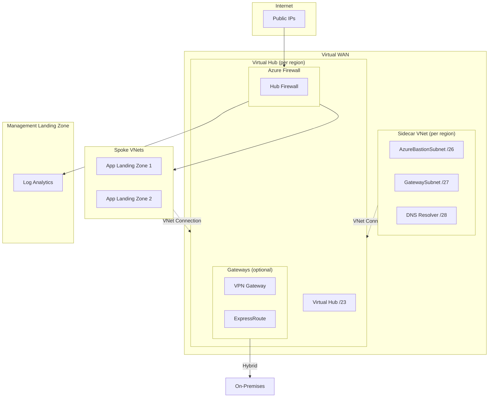

# Stacks Azure Platform Landing Zone - Connectivity - Virtual WAN

This module deploys a Virtual WAN network topology using Azure Verified Modules (AVM). It supports single or multi-region deployments with automatic IP allocation and CAF-compliant naming.

## Architecture



## Features

| Feature | Default | Description |
|---------|---------|-------------|
| Virtual WAN | ✅ | Standard SKU Virtual WAN |
| Virtual Hubs | ✅ | One per region with /23 address prefix |
| Azure Firewall | ✅ | Standard SKU (configurable: Basic/Standard/Premium) |
| Firewall DNS Proxy | ✅ | Enables FQDN filtering and DNS query logging |
| Firewall Diagnostics | ✅ | All log categories sent to Log Analytics |
| Sidecar Virtual Network | ✅ | For Bastion, DNS Resolver, and additional services |
| Private DNS Zones | ✅ | For Azure Private Link services |
| Private DNS Resolver | ❌ | For hybrid DNS resolution |
| Azure Bastion | ❌ | Secure VM access (in sidecar VNet) |
| VPN Gateway | ❌ | Site-to-Site/Point-to-Site VPN |
| ExpressRoute Gateway | ❌ | ExpressRoute connectivity |
| DDoS Protection Plan | ❌ | Shared across all hubs |

## Configuration Examples

### Single Region Deployment

```hcl
company_name                 = "ensono"
connectivity_subscription_id = "00000000-0000-0000-0000-000000000000"

# Azure Monitor Private Link Scope (enabled by default)
# Use remote state to fetch workspace ID from management module
management_remote_state = {
  storage_account_name = "<storage-account-name>"
}

hubs = {
  uksouth = {}
}
```

### Multi-Region Deployment

```hcl
hubs = {
  uksouth = {}
  ukwest  = {}
}
```

IP addresses are calculated automatically (sorted alphabetically). Each hub receives a `/16` block, with the Virtual Hub using a `/23`:

| Region | Hub Address Space | Virtual Hub Prefix |
|--------|------------------|-------------------|
| uksouth | `10.0.0.0/16` | `10.0.0.0/23` |
| ukwest | `10.1.0.0/16` | `10.1.0.0/23` |

> [!NOTE]
> The module supports up to 256 regions using the `10.0.0.0/8` address space. Regions are sorted alphabetically for consistent IP allocation across deployments.

### Cost Optimization for Non-Production

Use Firewall Basic SKU for dev/test environments:

```hcl
hubs = {
  uksouth = {
    features = {
      firewall_sku = "Basic"  # ~£180/month vs Standard ~£720/month
    }
  }
}
```

| Firewall SKU | Monthly Cost | Use Case |
|--------------|-------------|----------|
| Basic | ~£180 | Dev/Test, low throughput |
| Standard | ~£720 | Production, threat intelligence |
| Premium | ~£800 | TLS inspection, IDPS signatures |

> [!WARNING]
> Firewall Basic SKU has reduced throughput (250 Mbps) and fewer features. Not recommended for production.

### DDoS Protection Plan

DDoS Protection Plan is **disabled by default** due to significant cost (~£2,200/month flat fee).

```hcl
ddos_protection_plan = {
  enabled = true
}
```

### Cost Estimation

Estimated monthly costs per hub (UK South, January 2025):

| Resource | Default | Monthly Cost (GBP) | Notes |
|----------|---------|-------------------|-------|
| Virtual Hub | ✅ | ~£210 | Base hub cost |
| Azure Firewall Standard | ✅ | ~£720 | Hub firewall |
| Azure Firewall Basic | ❌ | ~£180 | Dev/test alternative |
| VPN Gateway | ❌ | ~£140 | Scale unit 1 |
| ExpressRoute Gateway | ❌ | ~£140 | Scale unit 1 |
| Azure Bastion Standard | ❌ | ~£140 | 2 scale units |
| DDoS Protection Plan | ❌ | ~£2,200 | Shared across subscription |
| Log Analytics | - | Variable | ~£2/GB/month ingestion |
| **Minimum (Hub + Firewall)** | | **~£930** | |
| **Full Production** | | **~£1,210** | Hub + Firewall + VPN + Bastion |

> [!TIP]
> Virtual WAN costs more than hub-spoke due to the managed hub infrastructure, but provides simplified routing and better scalability for large deployments.

### Firewall DNS Proxy

DNS Proxy is **enabled by default** on the firewall policy, as recommended by [Microsoft's Well-Architected Framework](https://learn.microsoft.com/en-us/azure/well-architected/service-guides/azure-firewall#security).

DNS Proxy provides:

- **FQDN filtering** - Required for network rules that filter by FQDN (not just IP)
- **DNS query logging** - All DNS queries are logged to Log Analytics
- **Consistent resolution** - All spoke workloads resolve DNS through the firewall

To disable DNS Proxy:

```hcl
hubs = {
  uksouth = {
    features = {
      firewall_dns_proxy = false
    }
  }
}
```

To use custom DNS servers:

```hcl
hubs = {
  uksouth = {
    dns = {
      servers = ["10.0.0.4", "10.0.0.5"]  # Custom upstream DNS
    }
    features = {
      firewall_dns_proxy = true  # Default, shown for clarity
    }
  }
}
```

### Production Configuration

For production workloads:

```hcl
hubs = {
  uksouth = {
    features = {
      firewall_sku       = "Standard"
      bastion            = true
      vpn_gateway        = true
    }
  }
}

# Enable firewall diagnostics via management remote state
management_remote_state = {
  enabled              = true
  storage_account_name = "<storage-account-name>"
}
```

### Enable Optional Features

```hcl
hubs = {
  uksouth = {
    features = {
      bastion              = true
      vpn_gateway          = true
      expressroute_gateway = true
      private_dns_resolver = true
    }
  }
}
```

### Custom IP Addressing

```hcl
hubs = {
  uksouth = {
    address_space = "172.16.0.0/16"
    sidecar_subnets = {
      bastion_address_prefix              = "172.16.4.0/26"
      gateway_address_prefix              = "172.16.4.64/27"
      private_dns_resolver_address_prefix = "172.16.4.96/28"
    }
  }
}
```

### Custom Resource Names

```hcl
hubs = {
  uksouth = {
    name_overrides = {
      resource_group          = "rg-vwan-hub-prod"
      virtual_hub             = "vhub-prod-uks"
      sidecar_virtual_network = "vnet-sidecar-prod"
      firewall                = "fw-hub-prod"
    }
  }
}
```

### Disable a Hub Temporarily

```hcl
hubs = {
  uksouth = {}
  ukwest  = { enabled = false }
}
```

## Comparison: Virtual WAN vs Hub-Spoke

| Aspect | Virtual WAN | Hub-Spoke |
|--------|-------------|-----------|
| **Management** | Fully managed hub | Self-managed VNet |
| **Routing** | Automatic any-to-any | Manual route tables |
| **Cost** | Higher base cost | Lower base cost |
| **Scalability** | Better for large networks | Good for small-medium |
| **Hybrid** | Built-in VPN/ER integration | Manual gateway setup |
| **Complexity** | Lower operational | Higher operational |

**Choose Virtual WAN when:**

- You have 50+ spoke VNets
- You need global transit routing
- You want simplified VPN/ExpressRoute management
- Operational simplicity is more important than cost

**Choose Hub-Spoke when:**

- You have fewer spoke VNets
- Cost optimization is critical
- You need granular routing control
- You have existing hub-spoke infrastructure

## Module Integration

This module can integrate with the Management Landing Zone to enable:

- Firewall diagnostics to Log Analytics
- Centralized monitoring and alerting

```hcl
management_remote_state = {
  storage_account_name = "<storage-account-name>"
}
```
