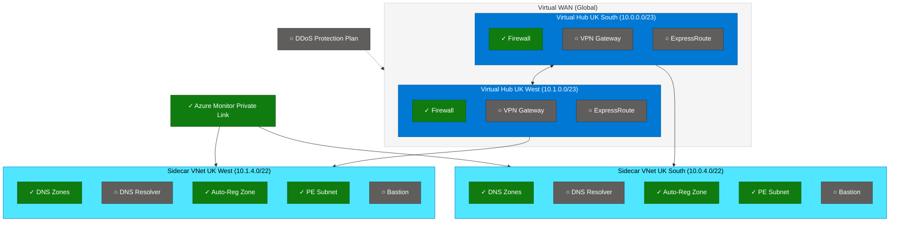

# Multi-Region Virtual WAN Example

This example deploys a **multi-region Virtual WAN topology** - the recommended architecture for production workloads requiring high availability and disaster recovery.

## Architecture



> [!NOTE]
> ✓ Enabled by default | ○ Optional (disabled)

## Quick Start

```bash
# 1. Copy example to workspace_variables directory (one file per region/environment)
cp virtual_wan.tfvars ../../workspace_variables/prd_uksouth_terraform.tfvars
cp virtual_wan.tfvars ../../workspace_variables/prd_ukwest_terraform.tfvars

# 2. Edit each tfvars file:
#    - Change hub regions (uksouth/ukwest) to your preferred locations
#    - Adjust features as needed

# 3. Ensure pipeline variables are configured (see below)

# 4. Initialize and deploy
eirctl infrastructure:plan
eirctl infrastructure:apply
```

## Configuration

### Required Pipeline Variables (`TF_VAR_`)

These values are injected as environment variables at pipeline runtime, not stored in tfvars files:

| Variable | Description | Example |
|----------|-------------|---------|
| `TF_VAR_company` | Company identifier (first 3 chars used in names) | `ensono` |
| `TF_VAR_connectivity_subscription_id` | Subscription for hub resources | `00000000-0000-0000-0000-000000000000` |

### Required Variables (tfvars)

| Variable | Description | Example |
|----------|-------------|---------|
| `hubs` | Map of hub configurations keyed by region | `{ uksouth = {}, ukwest = {} }` |

### Hub Features

Each hub can enable/disable these components:

| Feature | Default | Description |
|---------|---------|-------------|
| `firewall` | `true` | Azure Firewall (Secured Hub) |
| `firewall_sku` | `"Standard"` | Firewall SKU: Basic/Standard/Premium |
| `private_dns_zones` | `true` | Private Link DNS zones |
| `private_dns_resolver` | `false` | DNS resolver for hybrid scenarios |
| `sidecar_virtual_network` | `true` | Sidecar VNet for ancillary services |
| `bastion` | `false` | Azure Bastion for VM access |
| `vpn_gateway` | `false` | VPN Gateway (S2S/P2S) |
| `expressroute_gateway` | `false` | ExpressRoute Gateway |

### Module-Level Features

| Feature | Default | Description |
|---------|---------|-------------|
| `network_watcher.enabled` | `true` | Network Watcher (free) |
| `ddos_protection_plan.enabled` | `false` | DDoS Protection (~£2,330/month) |

### Example: Enable Bastion in Primary Hub

```hcl
hubs = {
  uksouth = {
    features = {
      bastion              = true
      private_dns_resolver = true
    }
  }
  ukwest = {}
}
```

### Example: Custom IP Ranges

```hcl
hubs = {
  uksouth = {
    address_space = "172.16.0.0/16"
  }
  ukwest = {
    address_space = "172.17.0.0/16"
  }
}
```

## What Gets Deployed

### Global Resources

- Virtual WAN (Standard SKU)
- Resource Group for Virtual WAN
- Optional: DDoS Protection Plan

### Per Hub (each region)

- Resource Group for hub resources
- Virtual Hub with Secured Hub (Azure Firewall)
- Sidecar Virtual Network for ancillary services
- Azure Firewall with policy (Standard SKU by default)
- Network Watcher (free network diagnostics)
- Private Endpoints subnet
- Automatic hub-to-hub routing (no VNet peering needed)
- Optional: Bastion, VPN Gateway, ExpressRoute Gateway

### Shared Resources (primary region)

- Private DNS zones for Azure Private Link services
- Private DNS Resolver for hybrid DNS
- Azure Monitor Private Link Scope (AMPLS) with endpoints in each hub

## Estimated Costs

| Component | Monthly Cost (approx) |
|-----------|----------------------|
| Virtual Hub | ~£145/hub |
| Azure Firewall (Basic) | ~£230/hub |
| Azure Firewall (Standard) | ~£720/hub |
| Azure Firewall (Premium) | ~£1,010/hub |
| Azure Bastion (Basic) | ~£110/hub |
| VPN Gateway (1 Scale Unit) | ~£210/hub |
| ExpressRoute Gateway (1 Scale Unit) | ~£240/hub |
| Private DNS Resolver | ~£145 |
| AMPLS Private Endpoint | ~£7/hub |
| DDoS Protection Plan | ~£2,330 (global) |

*Costs vary by region and configuration. Use the [Azure Pricing Calculator](https://azure.microsoft.com/pricing/calculator/) for accurate estimates.*

## Files

| File | Description |
|------|-------------|
| [virtual_wan.tfvars](./virtual_wan.tfvars) | Example configuration - copy to `workspace_variables/` |

## See Also

- [Single Region Example](../single_region/) - Simpler deployment (not recommended for production)
- [Module Variables](../../variables_hubs.tf) - Full variable documentation
