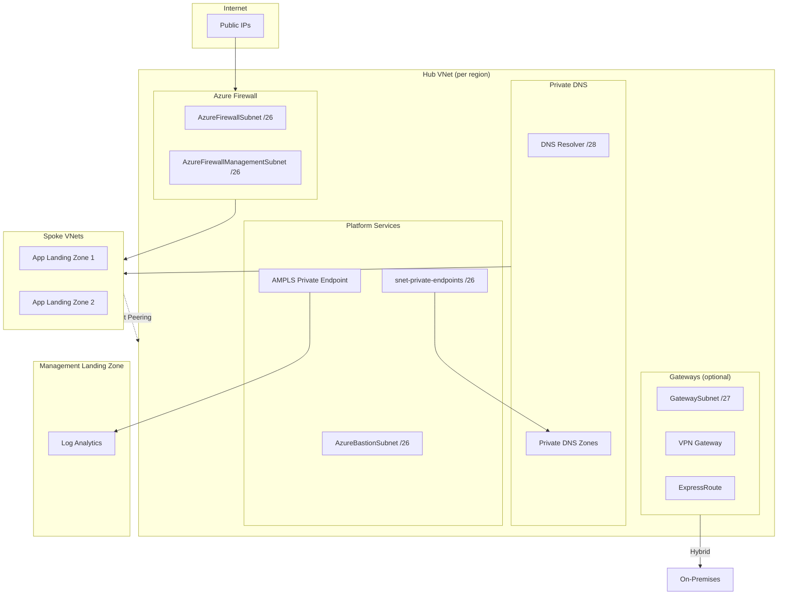

<!-- BEGIN_TF_DOCS -->
<!-- Code generated by terraform-docs. DO NOT EDIT. -->
# Stacks Azure Platform Landing Zone - Connectivity - Hub and Spoke

This module deploys hub virtual networks using Azure Verified Modules (AVM). It supports single or multi-region deployments with automatic IP allocation and CAF-compliant naming.

## Architecture



## Features

| Feature | Default | Description |
|---------|---------|-------------|
| Hub Virtual Networks | ✅ | With mesh peering for multi-region |
| Azure Firewall | ✅ | Standard SKU (configurable: Basic/Standard/Premium) |
| Firewall DNS Proxy | ✅ | Enables FQDN filtering and DNS query logging |
| Firewall Health Alerts | ✅ | Alerts for health, SNAT exhaustion, and throughput |
| Firewall Diagnostics | ✅ | All log categories sent to Log Analytics |
| Network Watcher | ✅ | Free network diagnostics (Connection Monitor, Packet Capture) |
| Private Endpoints NSG | ✅ | NSG for visibility and access control |
| Private DNS Zones | ✅ | For Azure Private Link services |
| Private DNS Resolver | ❌ | For hybrid DNS resolution |
| Azure Monitor Private Link | ✅ | Private connectivity to Log Analytics |
| Flow Logs | ❌ | VNet flow logs with per-region storage (storage costs apply) |
| Azure Bastion | ❌ | Secure VM access |
| VPN Gateway | ❌ | Site-to-Site/Point-to-Site VPN |
| VPN Gateway Diagnostics | ✅ | Tunnel, route, and IKE diagnostics (when gateway enabled) |
| ExpressRoute Gateway | ❌ | ExpressRoute connectivity |
| ExpressRoute Diagnostics | ✅ | Gateway and route diagnostics (when gateway enabled) |
| DDoS Protection Plan | ❌ | Shared across all hubs |

## Quick Start

```hcl
company_name                 = "ensono"
connectivity_subscription_id = "00000000-0000-0000-0000-000000000000"

hubs = {
  uksouth = {}
}
```

## Configuration Examples

### Multi-Region Deployment

```hcl
hubs = {
  uksouth = {}
  ukwest  = {}
}
```

IP addresses are calculated automatically (sorted alphabetically). Each hub receives a `/16` block, with the VNet using the first `/22`:

- uksouth: `10.0.0.0/22` (from `10.0.0.0/16`)
- ukwest: `10.1.0.0/22` (from `10.1.0.0/16`)

Mesh VNet peering is configured automatically between all hubs.

### Cost Optimization for Non-Production

Use Firewall Basic SKU for dev/test environments (~£540/month savings per hub):

```hcl
hubs = {
  uksouth = {
    features = {
      firewall_sku = "Basic"  # ~£180/month vs Standard ~£720/month
    }
  }
}
```

| Firewall SKU | Monthly Cost | Use Case |
|--------------|-------------|----------|
| Basic | ~£180 | Dev/Test, low throughput |
| Standard | ~£720 | Production, threat intelligence |
| Premium | ~£800 | TLS inspection, IDPS signatures |

> [!WARNING]
> Firewall Basic SKU has reduced throughput (250 Mbps) and fewer features. Not recommended for production.

### DDoS Protection Plan

DDoS Protection Plan is **disabled by default** due to significant cost (~£2,200/month flat fee). The plan is shared across all VNets in the subscription.

```hcl
ddos_protection_plan = {
  enabled = true
}
```

> [!NOTE]
> DDoS Protection Plan provides L3/L4 protection, telemetry, and rapid response support. Consider enabling for production workloads with public-facing endpoints.

### Cost Estimation

Estimated monthly costs per hub (UK South, January 2025):

| Resource | Default | Monthly Cost (GBP) | Notes |
|----------|---------|-------------------|-------|
| Azure Firewall Standard | ✅ | ~£720 | 3 AZ deployment |
| Azure Firewall Basic | ❌ | ~£180 | Dev/test alternative |
| VPN Gateway (VpnGw1AZ) | ❌ | ~£140 | Active-active |
| ExpressRoute Gateway | ❌ | ~£140 | ErGw1AZ SKU |
| Azure Bastion Standard | ❌ | ~£140 | 2 scale units |
| DDoS Protection Plan | ❌ | ~£2,200 | Shared across subscription |
| Log Analytics | - | Variable | ~£2/GB/month ingestion |
| **Minimum (Firewall only)** | | **~£720** | |
| **Full Production** | | **~£1,140** | Firewall + VPN + Bastion |

> [!TIP]
> For multi-region, multiply per-hub costs. DDoS Protection Plan is shared across all regions.

### Private Endpoints NSG

A Network Security Group is deployed on the private endpoints subnet by default, as recommended by [Microsoft's hub-spoke architecture guidance](https://learn.microsoft.com/en-us/azure/architecture/networking/guide/private-link-hub-spoke-network).

The NSG provides:
- **Visibility** - NSG flow logs for auditing and compliance
- **Access control** - Centralized place to control traffic to private endpoints
- **Defense in depth** - Additional security layer alongside Azure Firewall

Default rules:
| Rule | Priority | Direction | Action | Source | Destination |
|------|----------|-----------|--------|--------|-------------|
| AllowVNetInbound | 100 | Inbound | Allow | VirtualNetwork | VirtualNetwork |
| DenyInternetInbound | 4096 | Inbound | Deny | Internet | Any |

To disable the NSG:

```hcl
private_endpoints_nsg = {
  enabled = false
}
```

> [!NOTE]
> When using Azure Firewall, the NSG provides additional visibility and logging. Traffic is already controlled by the firewall, but the NSG enables NSG flow logs for the private endpoints subnet.

### Firewall DNS Proxy

DNS Proxy is **enabled by default** on the firewall policy, as recommended by [Microsoft's Well-Architected Framework](https://learn.microsoft.com/en-us/azure/well-architected/service-guides/azure-firewall#security).

DNS Proxy provides:
- **FQDN filtering** - Required for network rules that filter by FQDN (not just IP)
- **DNS query logging** - All DNS queries are logged to Log Analytics
- **Consistent resolution** - All spoke workloads resolve DNS through the firewall

When enabled, spoke VNets should configure their DNS servers to point to the firewall private IP (available via `firewall_private_ip_addresses` output).

To disable DNS Proxy:

```hcl
hubs = {
  uksouth = {
    features = {
      firewall_dns_proxy = false
    }
  }
}
```

To use custom DNS servers with DNS Proxy:

```hcl
hubs = {
  uksouth = {
    dns = {
      servers = ["10.0.0.4", "10.0.0.5"]  # Custom upstream DNS
    }
    features = {
      firewall_dns_proxy = true  # Default, shown for clarity
    }
  }
}
```

> [!TIP]
> DNS Proxy is essential for FQDN-based network rules. Without it, firewall network rules can only filter by IP address.

### Production Configuration

For production workloads, enable flow logs for network visibility:

```hcl
hubs = {
  uksouth = {
    features = {
      firewall_sku = "Standard"
    }
  }
}

# Flow logs with per-region storage (recommended)
flow_logs = {
  enabled        = true
  retention_days = 90
  storage = {
    create = true  # Creates storage account per hub region
  }
  traffic_analytics_enabled = true
}

# Traffic Analytics requires Log Analytics workspace
management_remote_state = {
  enabled              = true
  storage_account_name = "<storage-account-name>"
}
```

> [!NOTE]
> Availability zones are auto-detected. Regions that support zones (e.g., uksouth) automatically get zone-redundant resources with 99.99% SLA.

> [!IMPORTANT]
> **Storage Account Placement**: Azure requires flow logs storage accounts to be in the **same region** as the monitored VNet. This module creates one storage account per hub region in the connectivity subscription when `flow_logs.storage.create = true`. This is the recommended approach for multi-region deployments.

> [!NOTE]
> Traffic Analytics requires `management_remote_state` to be enabled to obtain the Log Analytics workspace GUID. If only `log_analytics_workspace_id` is provided directly, Traffic Analytics will be skipped.

### Availability Zones

Availability zones are **auto-detected** based on region support. Regions like `uksouth` that support zones will automatically deploy zone-redundant resources (99.99% SLA), while regions like `ukwest` without zone support will deploy without zones (99.95% SLA).

To explicitly override (e.g., disable zones for cost savings in dev/test):

```hcl
hubs = {
  uksouth = {
    features = {
      availability_zones = null  # Disable zones even in supported region
    }
  }
}
```

> [!NOTE]
> Zone-redundant deployments incur cross-zone data transfer charges (~£0.01/GB).

### Enable Optional Features

```hcl
hubs = {
  uksouth = {
    features = {
      bastion              = true
      vpn_gateway          = true
      expressroute_gateway = true
    }
  }
}
```

### Custom IP Addressing

```hcl
hubs = {
  uksouth = {
    address_space = "172.16.0.0/16"
    subnets = {
      firewall_address_prefix             = "172.16.0.0/26"
      bastion_address_prefix              = "172.16.0.64/26"
      private_endpoints_address_prefix    = "172.16.0.128/26"
      firewall_management_address_prefix  = "172.16.0.192/26"
      gateway_address_prefix              = "172.16.1.0/27"
      private_dns_resolver_address_prefix = "172.16.1.32/28"
    }
  }
}
```

### Custom Resource Names

```hcl
hubs = {
  uksouth = {
    name_overrides = {
      resource_group  = "rg-network-hub-prod"
      virtual_network = "vnet-hub-prod"
      firewall        = "fw-hub-prod"
    }
  }
}
```

### Custom DNS Zone

```hcl
hubs = {
  uksouth = {
    dns = {
      auto_registration_zone_name = "uksouth.corp.ensono.com"
    }
  }
}
```

### Disable a Hub Temporarily

```hcl
hubs = {
  uksouth = {}
  ukwest  = { enabled = false }
}
```

### Custom Subnets in Hub

```hcl
hubs = {
  uksouth = {
    custom_subnets = {
      management = {
        name             = "snet-management"
        address_prefixes = ["10.0.2.0/24"]
      }
    }
  }
}
```

### Flow Logs Storage Configuration

VNet flow logs require a storage account in the **same region** as the monitored VNet. This module can create per-region storage accounts automatically:

**Create storage per hub region (recommended):**

```hcl
flow_logs = {
  enabled = true
  storage = {
    create                   = true
    account_tier             = "Standard"
    account_replication_type = "GRS"   # LRS for dev/test
    retention_days           = 30      # Blob lifecycle retention
    public_network_access    = false
  }
  retention_days            = 90     # Flow logs retention (min 90 for compliance)
  traffic_analytics_enabled = true
}
```

**Use external storage accounts:**

If you have existing storage accounts, provide the ID per region:

```hcl
flow_logs = {
  enabled = true
  storage = {
    create                      = false
    external_storage_account_id = "/subscriptions/.../storageAccounts/existing-storage"
  }
}
```

> [!WARNING]
> The `external_storage_account_id` option only supports a single storage account. For multi-region deployments, use `storage.create = true` to create per-region storage accounts.

**Storage account outputs:**

The module exports storage account details for downstream use:

```hcl
output "flow_logs_storage_account_ids" {
  # Map of region => storage account ID
}

output "flow_logs_storage_account_names" {
  # Map of region => storage account name
}
```

### Azure Monitor Private Link

AMPLS is **enabled by default** to provide private connectivity to Log Analytics.

**Using remote state** (recommended):

```hcl
management_remote_state = {
  enabled              = true
  storage_account_name = "<storage-account-name>"
}
# Workspace ID is fetched automatically from management module
```

**Or provide workspace ID directly:**

```hcl
azure_monitor_private_link = {
  log_analytics_workspace_id = "/subscriptions/00000000-0000-0000-0000-000000000000/resourceGroups/rg-management/providers/Microsoft.OperationalInsights/workspaces/log-analytics"
}
```

**To disable AMPLS:**

```hcl
azure_monitor_private_link = {
  enabled = false
}
```

Application landing zones can add their own scoped services using the outputs:

```hcl
# In application landing zone
resource "azurerm_monitor_private_link_scoped_service" "app_insights" {
  name                = "appinsights-myapp"
  resource_group_name = data.terraform_remote_state.connectivity.outputs.ampls_resource_group_name
  scope_name          = data.terraform_remote_state.connectivity.outputs.ampls_name
  linked_resource_id  = azurerm_application_insights.this.id
}
```

## Spoke Integration

The module provides outputs for spoke landing zones to integrate with hub infrastructure.

### Route Traffic Through Firewall

```hcl
# In spoke landing zone
data "terraform_remote_state" "connectivity" {
  backend = "azurerm"
  config = {
    storage_account_name = "<storage-account>"
    container_name       = "tfstate"
    key                  = "connectivity.tfstate"
  }
}

resource "azurerm_subnet_route_table_association" "spoke" {
  subnet_id      = azurerm_subnet.workload.id
  route_table_id = data.terraform_remote_state.connectivity.outputs.route_table_user_subnets_ids["uksouth"]
}
```

### Link Private DNS Zones

```hcl
# Link spoke VNet to hub Private DNS zones for name resolution
resource "azurerm_private_dns_zone_virtual_network_link" "spoke" {
  for_each = data.terraform_remote_state.connectivity.outputs.private_dns_zone_resource_ids["uksouth"]

  name                  = "link-spoke-${var.spoke_name}"
  resource_group_name   = "rg-dns-uksouth"
  private_dns_zone_name = split("/", each.value)[8]
  virtual_network_id    = azurerm_virtual_network.spoke.id
  registration_enabled  = false
}
```

### VNet Peering to Hub

```hcl
resource "azurerm_virtual_network_peering" "spoke_to_hub" {
  name                      = "peer-to-hub"
  resource_group_name       = azurerm_resource_group.spoke.name
  virtual_network_name      = azurerm_virtual_network.spoke.name
  remote_virtual_network_id = data.terraform_remote_state.connectivity.outputs.virtual_network_resource_ids["uksouth"]
  allow_forwarded_traffic   = true
  use_remote_gateways       = true  # If VPN/ER gateway exists
}
```

### Available Outputs for Spoke Integration

| Output | Description |
|--------|-------------|
| `virtual_network_resource_ids` | Hub VNet IDs for peering |
| `firewall_private_ip_addresses` | Firewall IPs for custom routes |
| `route_table_user_subnets_ids` | Route tables forcing traffic through firewall |
| `private_dns_zone_resource_ids` | DNS zones for VNet linking |
| `dns_server_ip_addresses` | DNS Resolver IPs for spoke DNS settings |
| `ampls_name` / `ampls_resource_group_name` | For adding Application Insights to AMPLS |

## IP Address Layout

Default subnet layout within each hub's `/22`:

| Subnet | Size | Default Range (first hub) | Purpose |
|--------|------|--------------------------|---------|
| AzureFirewallSubnet | /26 | 10.0.0.0/26 | Azure Firewall (required name) |
| AzureBastionSubnet | /26 | 10.0.0.64/26 | Azure Bastion (required name) |
| snet-private-endpoints | /26 | 10.0.0.128/26 | Platform private endpoints |
| AzureFirewallManagementSubnet | /26 | 10.0.0.192/26 | Firewall management (required name) |
| GatewaySubnet | /27 | 10.0.1.0/27 | VPN/ExpressRoute (required name) |
| PrivateDnsResolverSubnet | /28 | 10.0.1.32/28 | Private DNS Resolver |

### IP Allocation Algorithm

Hubs are sorted alphabetically by region name to ensure deterministic IP allocation. Each hub receives a `/16` block, with the VNet using the first `/22`:

```text
Base: 10.0.0.0/8 (configurable via hub_network_address_prefix)

uksouth: 10.0.0.0/16 → VNet: 10.0.0.0/22
ukwest:  10.1.0.0/16 → VNet: 10.1.0.0/22
```

Each /22 provides 1024 IPs, divided into:

```text
┌─────────────────────────────────────────────────────────────┐
│                    Hub Address Space /22                     │
├─────────────────────────────────────────────────────────────┤
│  First /24 (256 IPs)           │  Second /24 (256 IPs)      │
│  ┌─────────┬─────────┐         │  ┌─────────┬─────────┐     │
│  │ /26     │ /26     │         │  │ /27     │ /28 /28 │     │
│  │ FW      │ Bastion │         │  │ Gateway │ DNS Rsv │     │
│  ├─────────┼─────────┤         │  └─────────┴─────────┘     │
│  │ /26     │ /26     │         │                            │
│  │ PE      │ FW Mgmt │         │  Remaining: custom subnets │
│  └─────────┴─────────┘         │                            │
└─────────────────────────────────────────────────────────────┘
```

## Testing

Unit tests validate configuration logic without deploying infrastructure. Tests use mock providers to run offline.

### Run Tests

```bash
eirctl test
```

### Test Coverage

| Test File | Description |
|-----------|-------------|
| `hub_networking.tftest.hcl` | Address space, subnets, multi-hub, mesh peering |
| `hub_resources.tftest.hcl` | Features, DDoS, AMPLS, flow logs, private endpoints NSG |

<!-- markdownlint-disable MD033 -->
## Requirements

The following requirements are needed by this module:

- <a name="requirement_terraform"></a> [terraform](#requirement\_terraform) (~> 1.12)

- <a name="requirement_azapi"></a> [azapi](#requirement\_azapi) (~> 2.0)

- <a name="requirement_azurerm"></a> [azurerm](#requirement\_azurerm) (~> 4.0)

- <a name="requirement_local"></a> [local](#requirement\_local) (~> 2.5)

- <a name="requirement_modtm"></a> [modtm](#requirement\_modtm) (~> 0.3)

- <a name="requirement_random"></a> [random](#requirement\_random) (~> 3.8)

## Resources

The following resources are used by this module:

- [azurerm_monitor_diagnostic_setting.expressroute_gateway](https://registry.terraform.io/providers/hashicorp/azurerm/latest/docs/resources/monitor_diagnostic_setting) (resource)
- [azurerm_monitor_diagnostic_setting.firewall](https://registry.terraform.io/providers/hashicorp/azurerm/latest/docs/resources/monitor_diagnostic_setting) (resource)
- [azurerm_monitor_diagnostic_setting.vpn_gateway](https://registry.terraform.io/providers/hashicorp/azurerm/latest/docs/resources/monitor_diagnostic_setting) (resource)
- [azurerm_monitor_metric_alert.firewall_health](https://registry.terraform.io/providers/hashicorp/azurerm/latest/docs/resources/monitor_metric_alert) (resource)
- [azurerm_monitor_metric_alert.firewall_snat_exhaustion](https://registry.terraform.io/providers/hashicorp/azurerm/latest/docs/resources/monitor_metric_alert) (resource)
- [azurerm_monitor_metric_alert.firewall_throughput](https://registry.terraform.io/providers/hashicorp/azurerm/latest/docs/resources/monitor_metric_alert) (resource)
- [azurerm_monitor_private_link_scope.this](https://registry.terraform.io/providers/hashicorp/azurerm/latest/docs/resources/monitor_private_link_scope) (resource)
- [azurerm_monitor_private_link_scoped_service.log_analytics](https://registry.terraform.io/providers/hashicorp/azurerm/latest/docs/resources/monitor_private_link_scoped_service) (resource)
- [azurerm_network_watcher.this](https://registry.terraform.io/providers/hashicorp/azurerm/latest/docs/resources/network_watcher) (resource)
- [azurerm_network_watcher_flow_log.vnet](https://registry.terraform.io/providers/hashicorp/azurerm/latest/docs/resources/network_watcher_flow_log) (resource)
- [azurerm_private_endpoint.ampls](https://registry.terraform.io/providers/hashicorp/azurerm/latest/docs/resources/private_endpoint) (resource)
- [azurerm_storage_management_policy.flow_logs](https://registry.terraform.io/providers/hashicorp/azurerm/latest/docs/resources/storage_management_policy) (resource)
- [azurerm_subnet_network_security_group_association.private_endpoints](https://registry.terraform.io/providers/hashicorp/azurerm/latest/docs/resources/subnet_network_security_group_association) (resource)
- [random_string.random_seed](https://registry.terraform.io/providers/hashicorp/random/latest/docs/resources/string) (resource)
- [terraform_data.validate_ampls_requirements](https://registry.terraform.io/providers/hashicorp/terraform/latest/docs/resources/data) (resource)
- [terraform_data.validate_flow_logs_requirements](https://registry.terraform.io/providers/hashicorp/terraform/latest/docs/resources/data) (resource)
- [azurerm_client_config.current](https://registry.terraform.io/providers/hashicorp/azurerm/latest/docs/data-sources/client_config) (data source)
- [terraform_remote_state.management](https://registry.terraform.io/providers/hashicorp/terraform/latest/docs/data-sources/remote_state) (data source)

<!-- markdownlint-disable MD013 -->
## Required Inputs

The following input variables are required:

### <a name="input_company_name"></a> [company\_name](#input\_company\_name)

Description: Company name used in resource naming. The first 3 characters are used as a prefix (e.g., 'ensono' becomes 'ens').

Type: `string`

### <a name="input_connectivity_subscription_id"></a> [connectivity\_subscription\_id](#input\_connectivity\_subscription\_id)

Description: Subscription ID for connectivity resources (hub networks, firewalls, DNS).

Type: `string`

### <a name="input_hubs"></a> [hubs](#input\_hubs)

Description: Hub virtual network configurations keyed by Azure region name.

Type:

```hcl
map(object({
    enabled       = optional(bool, true)
    address_space = optional(string)

    features = optional(object({
      firewall               = optional(bool, true)
      firewall_sku           = optional(string, "Standard")
      firewall_management_ip = optional(bool, false)
      firewall_dns_proxy     = optional(bool, true)
      bastion                = optional(bool, false)
      vpn_gateway            = optional(bool, false)
      expressroute_gateway   = optional(bool, false)
      private_dns_zones      = optional(bool, true)
      private_dns_resolver   = optional(bool, false)
      auto_registration_zone = optional(bool, false)
      availability_zones     = optional(list(string))
    }), {})

    subnets = optional(object({
      firewall_address_prefix             = optional(string)
      firewall_management_address_prefix  = optional(string)
      bastion_address_prefix              = optional(string)
      gateway_address_prefix              = optional(string)
      private_dns_resolver_address_prefix = optional(string)
      private_endpoints_address_prefix    = optional(string)
    }), {})

    custom_subnets = optional(map(object({
      name                                          = string
      address_prefixes                              = list(string)
      network_security_group_id                     = optional(string)
      route_table_id                                = optional(string)
      service_endpoints                             = optional(list(string))
      private_endpoint_network_policies             = optional(string, "Enabled")
      private_link_service_network_policies_enabled = optional(bool, true)
      delegation = optional(object({
        name         = string
        service_name = string
        actions      = optional(list(string))
      }))
    })), {})

    dns = optional(object({
      auto_registration_zone_name = optional(string)
      servers                     = optional(list(string))
    }), {})

    name_overrides = optional(object({
      resource_group       = optional(string)
      virtual_network      = optional(string)
      firewall             = optional(string)
      firewall_policy      = optional(string)
      bastion              = optional(string)
      vpn_gateway          = optional(string)
      expressroute_gateway = optional(string)
      private_dns_resolver = optional(string)
      route_table_firewall = optional(string)
      route_table_user     = optional(string)
    }), {})

    tags = optional(map(string), {})
  }))
```

## Optional Inputs

The following input variables are optional (have default values):

### <a name="input_azure_monitor_private_link"></a> [azure\_monitor\_private\_link](#input\_azure\_monitor\_private\_link)

Description: Azure Monitor Private Link Scope configuration for private connectivity to Log Analytics.

Type:

```hcl
object({
    enabled                    = optional(bool, true)
    log_analytics_workspace_id = optional(string)
    ingestion_access_mode      = optional(string, "PrivateOnly")
    query_access_mode          = optional(string, "PrivateOnly")
    name                       = optional(string)
  })
```

Default: `{}`

### <a name="input_ddos_protection_plan"></a> [ddos\_protection\_plan](#input\_ddos\_protection\_plan)

Description: DDoS Protection Plan configuration.

Type:

```hcl
object({
    enabled = optional(bool, false)
    name    = optional(string)
  })
```

Default: `{}`

### <a name="input_enable_avm_telemetry"></a> [enable\_avm\_telemetry](#input\_enable\_avm\_telemetry)

Description: Enable telemetry collection for Azure Verified Modules. See https://aka.ms/avm/telemetryinfo.

Type: `bool`

Default: `false`

### <a name="input_flow_logs"></a> [flow\_logs](#input\_flow\_logs)

Description:     Flow logs configuration for network traffic analysis. Disabled by default.

    Per Microsoft documentation, the storage account MUST be in the same region as the VNet.  
    This module creates a storage account per hub region to ensure compliance.

    When enabled, creates:
    - Storage account per hub region
    - VNet flow logs for each hub virtual network

    Storage options:
    - create: Set to true (default) to create storage accounts
    - external\_storage\_account\_id: If create=false, provide an existing storage account ID
      (must be in same region as hub VNet)

    Optional:
    - Traffic Analytics (requires Log Analytics workspace via management\_remote\_state)

    Cost considerations:
    - Storage: ~£0.02/GB stored (~£15-50/month depending on traffic volume)
    - Traffic Analytics: Additional Log Analytics ingestion costs

    Note: Retention defaults to 90 days to meet security compliance requirements (CKV\_AZURE\_12).

Type:

```hcl
object({
    enabled                   = optional(bool, false)
    retention_days            = optional(number, 90)
    traffic_analytics_enabled = optional(bool, false)
    storage = optional(object({
      create                      = optional(bool, true)
      external_storage_account_id = optional(string, null)
      access_tier                 = optional(string, "Hot")
      account_kind                = optional(string, "StorageV2")
      account_replication_type    = optional(string, "GRS")
      account_tier                = optional(string, "Standard") # Premium not supported
      min_tls_version             = optional(string, "TLS1_2")
      public_network_access       = optional(bool, false)
      shared_access_key_enabled   = optional(bool, true)
      retention_days              = optional(number, 30) # Blob lifecycle
      network_rules = optional(object({
        ip_rules                   = optional(list(string), [])
        virtual_network_subnet_ids = optional(list(string), [])
      }), {})
    }), {})
  })
```

Default: `{}`

### <a name="input_hub_network_address_prefix"></a> [hub\_network\_address\_prefix](#input\_hub\_network\_address\_prefix)

Description: Base address space for hub networks. Each hub receives a /16.

Type: `string`

Default: `"10.0.0.0/8"`

### <a name="input_management_remote_state"></a> [management\_remote\_state](#input\_management\_remote\_state)

Description: Configuration for fetching management landing zone outputs via remote state. Enabled by default - set enabled = false for local testing.

Type:

```hcl
object({
    enabled              = optional(bool, true)
    backend              = optional(string, "azurerm")
    workspace            = optional(string, null)
    storage_account_name = optional(string, null)
    container_name       = optional(string, "tfstate")
    key                  = optional(string, "management.tfstate")
    use_azuread_auth     = optional(bool, true)
  })
```

Default: `{}`

### <a name="input_network_watcher"></a> [network\_watcher](#input\_network\_watcher)

Description: Network Watcher configuration. Network Watcher is free and provides network diagnostics capabilities.

Type:

```hcl
object({
    enabled = optional(bool, true)
  })
```

Default: `{}`

### <a name="input_private_endpoints_nsg"></a> [private\_endpoints\_nsg](#input\_private\_endpoints\_nsg)

Description: Configuration for the Network Security Group on the private endpoints subnet.

NSG provides:
- Centralized access control for private endpoints
- Visibility through NSG flow logs
- Compliance auditing capability

Microsoft recommends using NSG on private endpoint subnets to control and log access.  
See: https://learn.microsoft.com/en-us/azure/architecture/networking/guide/private-link-hub-spoke-network

- `enabled` - (Optional) Deploy NSG on private endpoints subnet. Defaults to `true`.

Note: When `enabled = true`, an NSG with default rules is created:
- AllowVNetInbound (priority 100): Allow traffic from VirtualNetwork
- DenyInternetInbound (priority 4096): Deny traffic from Internet

Type:

```hcl
object({
    enabled = optional(bool, true)
  })
```

Default:

```json
{
  "enabled": true
}
```

### <a name="input_region_geography"></a> [region\_geography](#input\_region\_geography)

Description: Filter available regions by geography. Common values: 'United Kingdom', 'Europe', 'United States', 'Asia Pacific'. Set to null for all geographies.

Type: `string`

Default: `null`

### <a name="input_region_recommended_filter"></a> [region\_recommended\_filter](#input\_region\_recommended\_filter)

Description: Filter by Microsoft-recommended regions. Set to true for recommended only, false for non-recommended only, or null (default) for all regions.

Type: `bool`

Default: `null`

### <a name="input_resource_group_lock_enabled"></a> [resource\_group\_lock\_enabled](#input\_resource\_group\_lock\_enabled)

Description: Enable CanNotDelete locks on all resource groups. Set to false before running terraform destroy.

Type: `bool`

Default: `true`

### <a name="input_tags"></a> [tags](#input\_tags)

Description: Tags applied to all resources.

Type: `map(string)`

Default: `{}`

## Outputs

The following outputs are exported:

### <a name="output_ampls_id"></a> [ampls\_id](#output\_ampls\_id)

Description: AMPLS resource ID.

### <a name="output_ampls_name"></a> [ampls\_name](#output\_ampls\_name)

Description: AMPLS name.

### <a name="output_ampls_private_endpoint_ids"></a> [ampls\_private\_endpoint\_ids](#output\_ampls\_private\_endpoint\_ids)

Description: AMPLS private endpoint IDs, keyed by region.

### <a name="output_ampls_private_ip_addresses"></a> [ampls\_private\_ip\_addresses](#output\_ampls\_private\_ip\_addresses)

Description: AMPLS private IPs, keyed by region.

### <a name="output_ampls_resource_group_name"></a> [ampls\_resource\_group\_name](#output\_ampls\_resource\_group\_name)

Description: Resource group containing AMPLS.

### <a name="output_bastion_host_dns_names"></a> [bastion\_host\_dns\_names](#output\_bastion\_host\_dns\_names)

Description: Bastion DNS names, keyed by region.

### <a name="output_bastion_host_public_ip_addresses"></a> [bastion\_host\_public\_ip\_addresses](#output\_bastion\_host\_public\_ip\_addresses)

Description: Bastion public IPs, keyed by region.

### <a name="output_bastion_host_resource_ids"></a> [bastion\_host\_resource\_ids](#output\_bastion\_host\_resource\_ids)

Description: Bastion host resource IDs.

### <a name="output_dns_server_ip_addresses"></a> [dns\_server\_ip\_addresses](#output\_dns\_server\_ip\_addresses)

Description: DNS server IPs (firewall private IP when DNS Proxy enabled, or DNS Resolver IPs).

### <a name="output_firewall_diagnostic_setting_ids"></a> [firewall\_diagnostic\_setting\_ids](#output\_firewall\_diagnostic\_setting\_ids)

Description: Diagnostic setting IDs for firewall.

### <a name="output_firewall_policies"></a> [firewall\_policies](#output\_firewall\_policies)

Description: Firewall Policy resources.

### <a name="output_firewall_private_ip_addresses"></a> [firewall\_private\_ip\_addresses](#output\_firewall\_private\_ip\_addresses)

Description: Firewall private IPs for UDR next-hop.

### <a name="output_firewall_public_ip_addresses"></a> [firewall\_public\_ip\_addresses](#output\_firewall\_public\_ip\_addresses)

Description: Firewall public IPs, keyed by region.

### <a name="output_firewall_resource_ids"></a> [firewall\_resource\_ids](#output\_firewall\_resource\_ids)

Description: Azure Firewall resource IDs, keyed by region.

### <a name="output_firewall_resource_names"></a> [firewall\_resource\_names](#output\_firewall\_resource\_names)

Description: Azure Firewall names, keyed by region.

### <a name="output_flow_log_ids"></a> [flow\_log\_ids](#output\_flow\_log\_ids)

Description: VNet Flow Log resource IDs, keyed by region.

### <a name="output_flow_logs_storage_account_ids"></a> [flow\_logs\_storage\_account\_ids](#output\_flow\_logs\_storage\_account\_ids)

Description: Flow logs storage account IDs, keyed by region. Storage accounts are created per-region to meet Azure requirements.

### <a name="output_flow_logs_storage_account_names"></a> [flow\_logs\_storage\_account\_names](#output\_flow\_logs\_storage\_account\_names)

Description: Flow logs storage account names, keyed by region.

### <a name="output_hub_address_spaces"></a> [hub\_address\_spaces](#output\_hub\_address\_spaces)

Description: Address space per hub.

### <a name="output_hub_regions"></a> [hub\_regions](#output\_hub\_regions)

Description: Regions where hubs are deployed.

### <a name="output_network_watcher_ids"></a> [network\_watcher\_ids](#output\_network\_watcher\_ids)

Description: Network Watcher resource IDs, keyed by region.

### <a name="output_private_dns_zone_resource_ids"></a> [private\_dns\_zone\_resource\_ids](#output\_private\_dns\_zone\_resource\_ids)

Description: Private DNS zone resource IDs for spoke VNet linking. Keyed by region, then zone key.

### <a name="output_private_endpoints_nsg_ids"></a> [private\_endpoints\_nsg\_ids](#output\_private\_endpoints\_nsg\_ids)

Description: NSG resource IDs for private endpoints subnets, keyed by region.

### <a name="output_private_endpoints_nsg_names"></a> [private\_endpoints\_nsg\_names](#output\_private\_endpoints\_nsg\_names)

Description: NSG names for private endpoints subnets, keyed by region.

### <a name="output_resource_group_ids"></a> [resource\_group\_ids](#output\_resource\_group\_ids)

Description: Resource group IDs.

### <a name="output_resource_group_names"></a> [resource\_group\_names](#output\_resource\_group\_names)

Description: Resource group names.

### <a name="output_route_table_user_subnets_ids"></a> [route\_table\_user\_subnets\_ids](#output\_route\_table\_user\_subnets\_ids)

Description: Route table IDs for spoke subnet association (routes traffic through firewall).

### <a name="output_route_tables_firewall"></a> [route\_tables\_firewall](#output\_route\_tables\_firewall)

Description: Route tables for firewall subnets.

### <a name="output_route_tables_user_subnets"></a> [route\_tables\_user\_subnets](#output\_route\_tables\_user\_subnets)

Description: Route tables for spoke subnets.

### <a name="output_subnet_resource_ids"></a> [subnet\_resource\_ids](#output\_subnet\_resource\_ids)

Description: Hub subnet resource IDs for UDR association. Keyed by region.

### <a name="output_virtual_network_resource_ids"></a> [virtual\_network\_resource\_ids](#output\_virtual\_network\_resource\_ids)

Description: Hub VNet resource IDs.

### <a name="output_virtual_network_resource_names"></a> [virtual\_network\_resource\_names](#output\_virtual\_network\_resource\_names)

Description: Hub VNet names, keyed by region.

## Modules

The following Modules are called:

### <a name="module_azure_regions"></a> [azure\_regions](#module\_azure\_regions)

Source: Azure/avm-utl-regions/azurerm

Version: 0.9.3

### <a name="module_flow_logs_storage"></a> [flow\_logs\_storage](#module\_flow\_logs\_storage)

Source: Azure/avm-res-storage-storageaccount/azurerm

Version: 0.6.7

### <a name="module_hub_and_spoke_vnet"></a> [hub\_and\_spoke\_vnet](#module\_hub\_and\_spoke\_vnet)

Source: Azure/avm-ptn-alz-connectivity-hub-and-spoke-vnet/azurerm

Version: 0.16.8

### <a name="module_naming"></a> [naming](#module\_naming)

Source: Azure/naming/azurerm

Version: 0.4.3

### <a name="module_nsg_private_endpoints"></a> [nsg\_private\_endpoints](#module\_nsg\_private\_endpoints)

Source: Azure/avm-res-network-networksecuritygroup/azurerm

Version: 0.5.1

### <a name="module_resource_groups"></a> [resource\_groups](#module\_resource\_groups)

Source: Azure/avm-res-resources-resourcegroup/azurerm

Version: 0.2.1

<!-- END_TF_DOCS -->