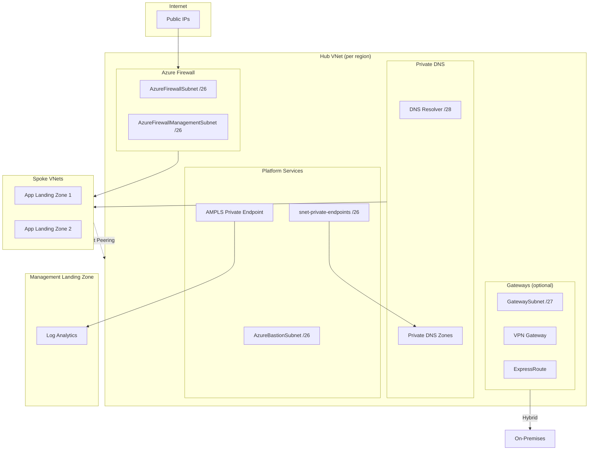

# Stacks Azure Platform Landing Zone - Connectivity - Hub and Spoke

This module deploys hub virtual networks using Azure Verified Modules (AVM). It supports single or multi-region deployments with automatic IP allocation and CAF-compliant naming.

## Architecture



## Features

| Feature | Default | Description |
|---------|---------|-------------|
| Hub Virtual Networks | ✅ | With mesh peering for multi-region |
| Azure Firewall | ✅ | Standard SKU (configurable: Basic/Standard/Premium) |
| Network Watcher | ✅ | Free network diagnostics (Connection Monitor, Packet Capture) |
| Private Endpoints NSG | ✅ | NSG for visibility and access control |
| Private DNS Zones | ✅ | For Azure Private Link services |
| Private DNS Resolver | ✅ | For hybrid DNS resolution |
| Azure Monitor Private Link | ✅ | Private connectivity to Log Analytics |
| Flow Logs | ❌ | NSG/VNet flow logs (storage costs apply) |
| Azure Bastion | ❌ | Secure VM access |
| VPN Gateway | ❌ | Site-to-Site/Point-to-Site VPN |
| ExpressRoute Gateway | ❌ | ExpressRoute connectivity |
| DDoS Protection Plan | ❌ | Shared across all hubs |

## Quick Start

```hcl
company_name                 = "ensono"
connectivity_subscription_id = "00000000-0000-0000-0000-000000000000"

hubs = {
  uksouth = {}
}
```

## Configuration Examples

### Multi-Region Deployment

```hcl
hubs = {
  uksouth = {}
  ukwest  = {}
}
```

IP addresses are calculated automatically (sorted alphabetically). Each hub receives a `/16` block, with the VNet using the first `/22`:

- uksouth: `10.0.0.0/22` (from `10.0.0.0/16`)
- ukwest: `10.1.0.0/22` (from `10.1.0.0/16`)

Mesh VNet peering is configured automatically between all hubs.

### Cost Optimization for Non-Production

Use Firewall Basic SKU for dev/test environments (~£540/month savings per hub):

```hcl
hubs = {
  uksouth = {
    features = {
      firewall_sku = "Basic"  # ~£180/month vs Standard ~£720/month
    }
  }
}
```

| Firewall SKU | Monthly Cost | Use Case |
|--------------|-------------|----------|
| Basic | ~£180 | Dev/Test, low throughput |
| Standard | ~£720 | Production, threat intelligence |
| Premium | ~£800 | TLS inspection, IDPS signatures |

> [!WARNING]
> Firewall Basic SKU has reduced throughput (250 Mbps) and fewer features. Not recommended for production.

### DDoS Protection Plan

DDoS Protection Plan is **disabled by default** due to significant cost (~£2,200/month flat fee). The plan is shared across all VNets in the subscription.

```hcl
ddos_protection_plan = {
  enabled = true
}
```

> [!NOTE]
> DDoS Protection Plan provides L3/L4 protection, telemetry, and rapid response support. Consider enabling for production workloads with public-facing endpoints.

### Private Endpoints NSG

A Network Security Group is deployed on the private endpoints subnet by default, as recommended by [Microsoft's hub-spoke architecture guidance](https://learn.microsoft.com/en-us/azure/architecture/networking/guide/private-link-hub-spoke-network).

The NSG provides:
- **Visibility** - NSG flow logs for auditing and compliance
- **Access control** - Centralized place to control traffic to private endpoints
- **Defense in depth** - Additional security layer alongside Azure Firewall

Default rules:
| Rule | Priority | Direction | Action | Source | Destination |
|------|----------|-----------|--------|--------|-------------|
| AllowVNetInbound | 100 | Inbound | Allow | VirtualNetwork | VirtualNetwork |
| DenyInternetInbound | 4096 | Inbound | Deny | Internet | Any |

To disable the NSG:

```hcl
private_endpoints_nsg = {
  enabled = false
}
```

> [!NOTE]
> When using Azure Firewall, the NSG provides additional visibility and logging. Traffic is already controlled by the firewall, but the NSG enables NSG flow logs for the private endpoints subnet.

### Production Configuration

For production workloads, enable availability zones and flow logs:

```hcl
hubs = {
  uksouth = {
    features = {
      firewall_sku       = "Standard"
      availability_zones = ["1", "2", "3"]
    }
  }
}

# Flow logs require storage account from management module
management_remote_state = {
  enabled              = true
  storage_account_name = "<storage-account-name>"
}

flow_logs = {
  enabled                   = true
  retention_days            = 90
  traffic_analytics_enabled = true
}
```

> [!NOTE]
> Flow logs require a storage account ID from the management module (via `management_remote_state`) or provided directly via `flow_logs.storage_account_id`. This design enables Azure Policy to deploy flow logs using a central storage account.

> [!NOTE]
> Traffic Analytics requires `management_remote_state` to be enabled to obtain the Log Analytics workspace GUID. If only `log_analytics_workspace_id` is provided directly, Traffic Analytics will be skipped.

### Enable Optional Features

```hcl
hubs = {
  uksouth = {
    features = {
      bastion              = true
      vpn_gateway          = true
      expressroute_gateway = true
      availability_zones   = ["1", "2", "3"]
    }
  }
}
```

> [!NOTE]
> Availability Zones provide a 99.99% SLA, but incur cross-zone data transfer charges (~£0.01/GB).

### Custom IP Addressing

```hcl
hubs = {
  uksouth = {
    address_space = "172.16.0.0/16"
    subnets = {
      firewall_address_prefix             = "172.16.0.0/26"
      bastion_address_prefix              = "172.16.0.64/26"
      private_endpoints_address_prefix    = "172.16.0.128/26"
      firewall_management_address_prefix  = "172.16.0.192/26"
      gateway_address_prefix              = "172.16.1.0/27"
      private_dns_resolver_address_prefix = "172.16.1.32/28"
    }
  }
}
```

### Custom Resource Names

```hcl
hubs = {
  uksouth = {
    name_overrides = {
      resource_group  = "rg-network-hub-prod"
      virtual_network = "vnet-hub-prod"
      firewall        = "fw-hub-prod"
    }
  }
}
```

### Custom DNS Zone

```hcl
hubs = {
  uksouth = {
    dns = {
      auto_registration_zone_name = "uksouth.corp.ensono.com"
    }
  }
}
```

### Disable a Hub Temporarily

```hcl
hubs = {
  uksouth = {}
  ukwest  = { enabled = false }
}
```

### Custom Subnets in Hub

```hcl
hubs = {
  uksouth = {
    custom_subnets = {
      management = {
        name             = "snet-management"
        address_prefixes = ["10.0.2.0/24"]
      }
    }
  }
}
```

### Azure Monitor Private Link

AMPLS is **enabled by default** to provide private connectivity to Log Analytics.

**Using remote state** (recommended):

```hcl
management_remote_state = {
  enabled              = true
  storage_account_name = "<storage-account-name>"
}
# Workspace ID is fetched automatically from management module
```

**Or provide workspace ID directly:**

```hcl
azure_monitor_private_link = {
  log_analytics_workspace_id = "/subscriptions/00000000-0000-0000-0000-000000000000/resourceGroups/rg-management/providers/Microsoft.OperationalInsights/workspaces/log-analytics"
}
```

**To disable AMPLS:**

```hcl
azure_monitor_private_link = {
  enabled = false
}
```

Application landing zones can add their own scoped services using the outputs:

```hcl
# In application landing zone
resource "azurerm_monitor_private_link_scoped_service" "app_insights" {
  name                = "appinsights-myapp"
  resource_group_name = data.terraform_remote_state.connectivity.outputs.ampls_resource_group_name
  scope_name          = data.terraform_remote_state.connectivity.outputs.ampls_name
  linked_resource_id  = azurerm_application_insights.this.id
}
```

## Spoke Integration

The module provides outputs for spoke landing zones to integrate with hub infrastructure.

### Route Traffic Through Firewall

```hcl
# In spoke landing zone
data "terraform_remote_state" "connectivity" {
  backend = "azurerm"
  config = {
    storage_account_name = "<storage-account>"
    container_name       = "tfstate"
    key                  = "connectivity.tfstate"
  }
}

resource "azurerm_subnet_route_table_association" "spoke" {
  subnet_id      = azurerm_subnet.workload.id
  route_table_id = data.terraform_remote_state.connectivity.outputs.route_table_user_subnets_ids["uksouth"]
}
```

### Link Private DNS Zones

```hcl
# Link spoke VNet to hub Private DNS zones for name resolution
resource "azurerm_private_dns_zone_virtual_network_link" "spoke" {
  for_each = data.terraform_remote_state.connectivity.outputs.private_dns_zone_resource_ids["uksouth"]

  name                  = "link-spoke-${var.spoke_name}"
  resource_group_name   = "rg-dns-uksouth"
  private_dns_zone_name = split("/", each.value)[8]
  virtual_network_id    = azurerm_virtual_network.spoke.id
  registration_enabled  = false
}
```

### VNet Peering to Hub

```hcl
resource "azurerm_virtual_network_peering" "spoke_to_hub" {
  name                      = "peer-to-hub"
  resource_group_name       = azurerm_resource_group.spoke.name
  virtual_network_name      = azurerm_virtual_network.spoke.name
  remote_virtual_network_id = data.terraform_remote_state.connectivity.outputs.virtual_network_resource_ids["uksouth"]
  allow_forwarded_traffic   = true
  use_remote_gateways       = true  # If VPN/ER gateway exists
}
```

### Available Outputs for Spoke Integration

| Output | Description |
|--------|-------------|
| `virtual_network_resource_ids` | Hub VNet IDs for peering |
| `firewall_private_ip_addresses` | Firewall IPs for custom routes |
| `route_table_user_subnets_ids` | Route tables forcing traffic through firewall |
| `private_dns_zone_resource_ids` | DNS zones for VNet linking |
| `dns_server_ip_addresses` | DNS Resolver IPs for spoke DNS settings |
| `ampls_name` / `ampls_resource_group_name` | For adding Application Insights to AMPLS |

## IP Address Layout

Default subnet layout within each hub's `/22`:

| Subnet | Size | Default Range (first hub) | Purpose |
|--------|------|--------------------------|---------|
| AzureFirewallSubnet | /26 | 10.0.0.0/26 | Azure Firewall (required name) |
| AzureBastionSubnet | /26 | 10.0.0.64/26 | Azure Bastion (required name) |
| snet-private-endpoints | /26 | 10.0.0.128/26 | Platform private endpoints |
| AzureFirewallManagementSubnet | /26 | 10.0.0.192/26 | Firewall management (required name) |
| GatewaySubnet | /27 | 10.0.1.0/27 | VPN/ExpressRoute (required name) |
| PrivateDnsResolverSubnet | /28 | 10.0.1.32/28 | Private DNS Resolver |

### IP Allocation Algorithm

Hubs are sorted alphabetically by region name to ensure deterministic IP allocation. Each hub receives a `/16` block, with the VNet using the first `/22`:

```text
Base: 10.0.0.0/8 (configurable via hub_network_address_prefix)

uksouth: 10.0.0.0/16 → VNet: 10.0.0.0/22
ukwest:  10.1.0.0/16 → VNet: 10.1.0.0/22
```

Each /22 provides 1024 IPs, divided into:

```text
┌─────────────────────────────────────────────────────────────┐
│                    Hub Address Space /22                     │
├─────────────────────────────────────────────────────────────┤
│  First /24 (256 IPs)           │  Second /24 (256 IPs)      │
│  ┌─────────┬─────────┐         │  ┌─────────┬─────────┐     │
│  │ /26     │ /26     │         │  │ /27     │ /28 /28 │     │
│  │ FW      │ Bastion │         │  │ Gateway │ DNS Rsv │     │
│  ├─────────┼─────────┤         │  └─────────┴─────────┘     │
│  │ /26     │ /26     │         │                            │
│  │ PE      │ FW Mgmt │         │  Remaining: custom subnets │
│  └─────────┴─────────┘         │                            │
└─────────────────────────────────────────────────────────────┘
```

## Testing

Unit tests validate configuration logic without deploying infrastructure. Tests use mock providers to run offline.

### Run Tests

```bash
cd deploy/terraform
eirctl test
```

### Test Coverage

| Test File | Description |
|-----------|-------------|
| `hub_networking.tftest.hcl` | Address space, subnets, multi-hub, mesh peering |
| `hub_resources.tftest.hcl` | Features, gateways, DNS, DDoS, AMPLS, firewall SKU, Network Watcher, flow logs, private endpoints NSG |
| `naming_and_tags.tftest.hcl` | CAF naming conventions, tags |
