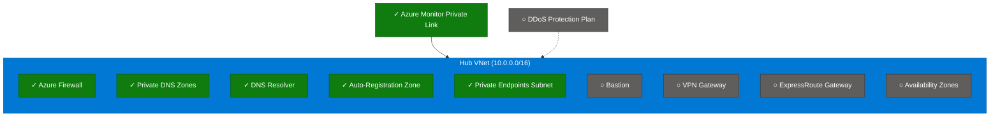

# Single-Region Hub-Spoke Example

> [!WARNING]
> **Not Recommended for Production**: Single-region deployments lack disaster recovery and high availability capabilities. Consider the [multi-region example](../multi_region/README.md) for production workloads.

This example deploys a **minimal single-region hub-spoke network** suitable for development, testing, or proof-of-concept scenarios.

## Architecture



> [!NOTE]
> ✓ Enabled by default | ○ Optional (disabled)

## Quick Start

```bash
# 1. Copy example to root terraform directory
cp hub_and_spoke_vnet.tfvars ../../terraform.tfvars

# 2. Edit terraform.tfvars:
#    - Set connectivity_subscription_id
#    - Change hub region (uksouth) to your preferred location

# 3. Initialize and deploy
eirctl infrastructure:plan
eirctl infrastructure:apply
```

## Configuration

### Required Variables

| Variable | Description | Example |
|----------|-------------|---------|
| `company_name` | Company identifier (first 3 chars used in names) | `"Ensono"` |
| `connectivity_subscription_id` | Subscription for hub resources | `"12345678-..."` |
| `hubs` | Single hub configuration | `{ uksouth = {} }` |

### Change Region

Simply change the map key to your preferred Azure region:

```hcl
# UK South
hubs = { uksouth = {} }

# UK West
hubs = { ukwest = {} }
```

### Enable Optional Features

```hcl
hubs = {
  uksouth = {
    features = {
      bastion    = true  # Secure VM access
      vpn_gateway = true  # On-premises connectivity
    }
  }
}
```

## What Gets Deployed

- Resource Group for hub resources
- Virtual Network with required subnets
- Azure Firewall with policy
- Route tables for firewall routing
- Private DNS zones for Azure Private Link
- Private DNS Resolver
- Private Endpoints subnet (`snet-private-endpoints`)
- Azure Monitor Private Link Scope (AMPLS) with private endpoint
- Optional: Bastion, VPN Gateway, ExpressRoute Gateway

## Estimated Costs

| Component | Monthly Cost (approx) |
|-----------|----------------------|
| Azure Firewall (Basic) | ~£720 |
| Azure Bastion (Basic) | ~£110 |
| VPN Gateway (VpnGw1) | ~£110 |
| Private DNS Resolver | ~£145 |
| AMPLS Private Endpoint | ~£7 |

*Costs vary by region. Use the [Azure Pricing Calculator](https://azure.microsoft.com/pricing/calculator/) for accurate estimates.*

## Upgrading to Multi-Region

To add a second hub for high availability:

```hcl
hubs = {
  uksouth = {}   # Existing hub
  ukwest  = {}   # New secondary hub (automatically peered)
}
```

## Files

| File | Description |
|------|-------------|
| [hub_and_spoke_vnet.tfvars](./hub_and_spoke_vnet.tfvars) | Example configuration - copy to `terraform.tfvars` |

## See Also

- [Multi-Region Example](../multi_region/) - Recommended for production
- [Module Variables](../../variables.hubs.tf) - Full variable documentation
