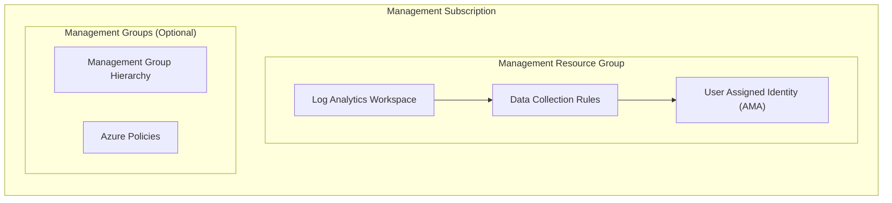
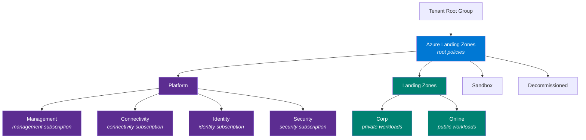

# Stacks Azure Platform Landing Zone - Management

This module deploys management resources using Azure Verified Modules (AVM). It provides centralized logging, monitoring, and an optional default management group architecture for Azure Landing Zones.

## Architecture



## Features

| Feature | Default | Description |
| ------- | ------- | ----------- |
| Log Analytics Workspace | ✅ | Central logging for all Azure resources |
| Data Collection Rules | ✅ | Change Tracking, VM Insights (Defender for SQL optional) |
| Azure Monitor Agent Identity | ✅ | User-assigned managed identity for AMA |
| Resource Group Locks | ✅ | `CanNotDelete` locks on resource groups |
| Log Analytics Diagnostics | ✅ | Self-monitoring diagnostic settings |
| Health Monitoring Alerts | ❌ | Ingestion latency, query failures |
| Management Groups | ❌ | Management group hierarchy with policies |

## Configuration Examples

### Management Resources Only (Default)

Deploys Log Analytics and Data Collection Rules with sensible defaults:

```hcl
company_name               = "ensono"
location                   = "uksouth"
management_subscription_id = "00000000-0000-0000-0000-000000000000"
```

### Customising Management Resources

Override specific settings while using defaults for the rest:

```hcl
company_name               = "ensono"
location                   = "uksouth"
management_subscription_id = "00000000-0000-0000-0000-000000000000"

# Customize retention and disable VM Insights DCR
management_resource_settings = {
  log_analytics_workspace_retention_in_days = 90

  data_collection_rules = {
    vm_insights = { enabled = false }
  }
}
```

### Full Azure Landing Zone with Management Groups

Deploy a complete Azure Landing Zone management group architecture with policies:

```hcl
company_name               = "ensono"
location                   = "uksouth"
management_subscription_id = "00000000-0000-0000-0000-000000000000"

# Required: Platform subscriptions
connectivity_subscription_id = "11111111-1111-1111-1111-111111111111"
identity_subscription_id     = "22222222-2222-2222-2222-222222222222"

# Optional: Security subscription
# security_subscription_id = "33333333-3333-3333-3333-333333333333"

# Enable management groups (deploys under tenant root group by default)
management_groups_enabled = true
}
```

#### Management Group Architecture

When `management_groups_enabled = true`, the module deploys the following Azure Landing Zone management group architecture:



>[!NOTE]
> Platform subscriptions are automatically placed into their respective management groups when subscription IDs are provided.

> [!NOTE]
> Management Groups deployments require elevated permissions (`Management Group Contributor` at Tenant Root level, and `Owner` in each subscription).

#### Customising Management Groups

##### Updating the Management Group Architecture

If the architecture needs to be changed, ensure you update the [alz_custom.alz_architecture_definition.yaml](./deploy/terraform/lib/architecture_definitions/alz_custom.alz_architecture_definition.yaml) file to suit your requirements.

##### Existing Management Group

It's recommended to keep the hierarchy flat where possible, but if an existing management group is being used as the root, ensure you update the [alz_custom.alz_architecture_definition.yaml](./deploy/terraform/lib/architecture_definitions/alz_custom.alz_architecture_definition.yaml) file. For example

```yaml
management_groups:
  - id: existing_group
    display_name: Existing Group
    archetypes:
      - root
    parent_id: null # setting to null indicates to the provider that we should use the parent resource id
    exists: true
```

#### Using Azure Landing Zones Library Policies (No Customisation)

The module by default uses the standard [ALZ Library](https://github.com/Azure/Azure-Landing-Zones-Library/tree/main/platform/alz) policies without custom overrides. Policy default values and assignments are managed in the [locals_policy_assignments.tf](./deploy/terraform/locals_policy_assignments.tf) file.

#### Development/Testing (Single Subscription)

For testing with only a management subscription:

```hcl
management_subscription_id = "00000000-0000-0000-0000-000000000000"

management_groups_enabled    = true
skip_subscription_placement  = true  # Skips connectivity/identity validation
```

## Integration with Connectivity Module

The management module outputs are consumed by the connectivity module via Terraform remote state:

**Management module outputs:**

- `log_analytics_workspace_id` - Used for AMPLS and diagnostics
- `log_analytics_workspace_name` - Log Analytics Workspace name
- `log_analytics_workspace_guid` - Used for Traffic Analytics

**Connectivity module configuration:**

```hcl
management_remote_state = {
  enabled              = true
  storage_account_name = "<tfstate-storage-account>"
}
```

## Azure Monitor Private Link Scope (AMPLS)

This module is designed to work with AMPLS deployed by the connectivity module. By default, Log Analytics is configured with secure settings that require private connectivity:

| Setting | Default | Description |
| ------- | ------- | ----------- |
| `internet_ingestion_enabled` | `false` | Blocks data ingestion from public internet |
| `internet_query_enabled` | `false` | Blocks queries from public internet |
| `local_authentication_enabled` | `false` | Requires Entra ID authentication |

### Deployment Order

1. **Management module** - Creates Log Analytics Workspace with private-only settings
2. **Connectivity module** - Creates AMPLS and links Log Analytics to private network

### Enabling Public Access (Development Only)

For development environments without private networking, you can enable public access:

```hcl
management_resource_settings = {
  # Enable public access for development/testing (not recommended for production)
  log_analytics_workspace_internet_ingestion_enabled   = true
  log_analytics_workspace_internet_query_enabled       = true
  log_analytics_workspace_local_authentication_enabled = true
}
```

> [!WARNING]
> Enabling public access reduces security. Use only in development environments where AMPLS is not deployed.

## Reliability and Zone Redundancy

The module implements Azure Well-Architected Framework reliability best practices:

### Log Analytics Workspace

| Feature | Status | Notes |
| ------- | ------ | ----- |
| Data Resilience | ✅ Automatic | Data replicated across availability zones in supported regions |
| Service Resilience | ⚠️ Regional | Requires dedicated cluster for full zone-redundant service operations |
| Diagnostics | ✅ Enabled | Self-monitoring via diagnostic settings |

**Supported regions for data resilience**: UK South, West Europe, East US, West US 2, and [others](https://learn.microsoft.com/azure/azure-monitor/logs/availability-zones#supported-regions).

### For High Availability Requirements

For mission-critical deployments requiring service resilience (not just data resilience):

```hcl
# Consider dedicated clusters for high-volume, mission-critical workloads
# Requires 500+ GB/day commitment
management_resource_settings = {
  log_analytics_workspace_sku = "CapacityReservation"
  log_analytics_workspace_reservation_capacity_in_gb_per_day = 500
}
```

> [!NOTE]
> Dedicated clusters provide service resilience (query availability during zone failures) but require minimum 500 GB/day commitment. For most workloads, standard data resilience is sufficient.

## Health Monitoring Alerts

The module supports optional Azure Monitor health monitoring alerts to ensure the observability infrastructure remains healthy. Alerts are automatically enabled when an action group ID is provided:

```hcl
monitoring_alerts = {
  action_group_id = "/subscriptions/.../resourceGroups/.../providers/Microsoft.Insights/actionGroups/platform-alerts"
}
```

To customize thresholds:

```hcl
monitoring_alerts = {
  action_group_id                     = "/subscriptions/.../resourceGroups/.../providers/Microsoft.Insights/actionGroups/platform-alerts"
  ingestion_latency_threshold_seconds = 60   # Alert if latency > 1 minute (default: 120)
  enable_query_failure_alerts         = true # Monitor query failures (default: true)
  query_failure_threshold             = 10   # Alert after 10 failures (default: 5)
}
```

### Alert Types

| Alert | Severity | Description |
| ----- | -------- | ----------- |
| Ingestion Latency | 2 (Warning) | Triggers when data ingestion latency exceeds threshold |
| Query Failures | 2 (Warning) | Triggers when query failures exceed threshold |

> [!NOTE]
> Create an Action Group in Azure Monitor before enabling alerts to receive notifications via email, SMS, webhook, or other channels.

## Estimated Monthly Costs

The following table provides estimated monthly costs for typical deployments. Actual costs vary based on data ingestion volume, retention, and region.

| Resource | Configuration | Estimated Cost (GBP) |
| -------- | ------------- | -------------------- |
| Log Analytics Workspace | PerGB2018, ~5 GB/day | ~£58/month |
| Data Collection Rules | N/A | Included |
| User Assigned Managed Identity | N/A | Free |
| Management Groups | N/A | Free |
| Azure Policies | N/A | Free |

**Typical Total**: ~£58/month (varies by ingestion volume)

> [!TIP]
>
> - Use [Azure Pricing Calculator](https://azure.microsoft.com/pricing/calculator/) for precise estimates
> - Consider commitment tiers for 15-25% savings on predictable workloads (100+ GB/day)
> - Set `log_analytics_workspace_daily_quota_gb` to cap unexpected ingestion costs

## Cost Optimization

The module follows Azure Well-Architected Framework cost optimization guidance:

### Log Analytics Workspace Cost Settings

| Setting | Default | Cost Impact |
| ------- | ------- | ----------- |
| `log_analytics_workspace_daily_quota_gb` | `-1` (unlimited) | Set a cap to prevent runaway costs |
| `log_analytics_workspace_sku` | `PerGB2018` | Pay-as-you-go pricing |
| `log_analytics_workspace_reservation_capacity_in_gb_per_day` | `null` | Use commitment tiers for 15-25% savings |

**Commitment tier pricing** (requires `sku = "CapacityReservation"`):

```hcl
management_resource_settings = {
  log_analytics_workspace_sku                                = "CapacityReservation"
  log_analytics_workspace_reservation_capacity_in_gb_per_day = 100  # 100, 200, 300, 400, or 500 GB/day
}
```

## Resource Naming

Resources follow Cloud Adoption Framework (CAF) naming conventions using the [Azure Naming module](https://registry.terraform.io/modules/Azure/naming/azurerm/latest):

| Resource | Pattern | Example |
| -------- | ------- | ------- |
| Resource Group | `rg-{company}-{region}-{env}-man-001` | `rg-ens-uks-dev-man-001` |
| Log Analytics | `log-{company}-{region}-{env}-man-001` | `log-ens-uks-dev-man-001` |
| User Assigned Identity | `uai-ama` | `uai-ama` |
| Data Collection Rule | `dcr-{type}` | `dcr-change-tracking` |

### Naming Strategy

The module uses deterministic naming with `001` suffixes for all resources by default. This ensures resource names are known at plan time, which is [required for ALZ policy assignments](https://registry.terraform.io/modules/Azure/avm-ptn-alz/azurerm/latest#unknown-values--depends-on).

### Data Collection Rule Names

DCR names use AVM defaults but can be customized:

| DCR | Default Name | Description |
| --- | ------------ | ----------- |
| Change Tracking | `dcr-change-tracking` | File and registry change monitoring |
| VM Insights | `dcr-vm-insights` | VM performance and dependency data |
| Defender for SQL | `dcr-defender-sql` | SQL security telemetry |

To override DCR names:

```hcl
management_resource_settings = {
  data_collection_rules = {
    change_tracking = { name = "dcr-custom-change-tracking" }
    vm_insights     = { name = "dcr-custom-vm-insights" }
    defender_sql    = { enabled = true, name = "dcr-custom-defender-sql" }
  }
}
```
